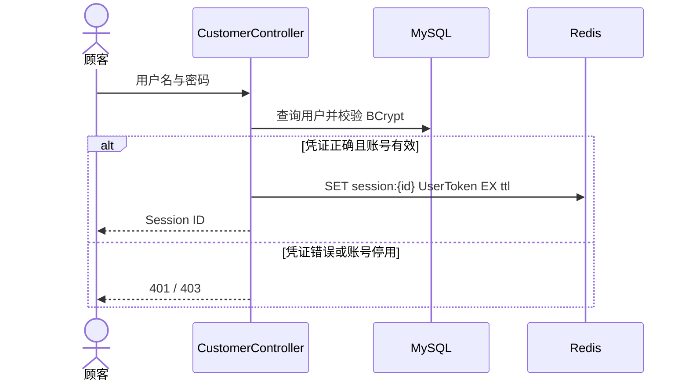
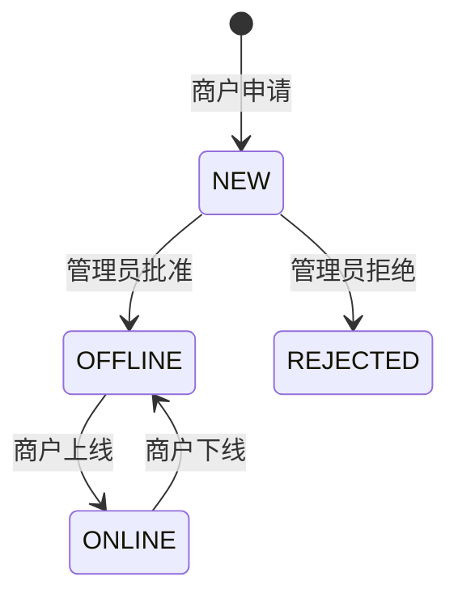
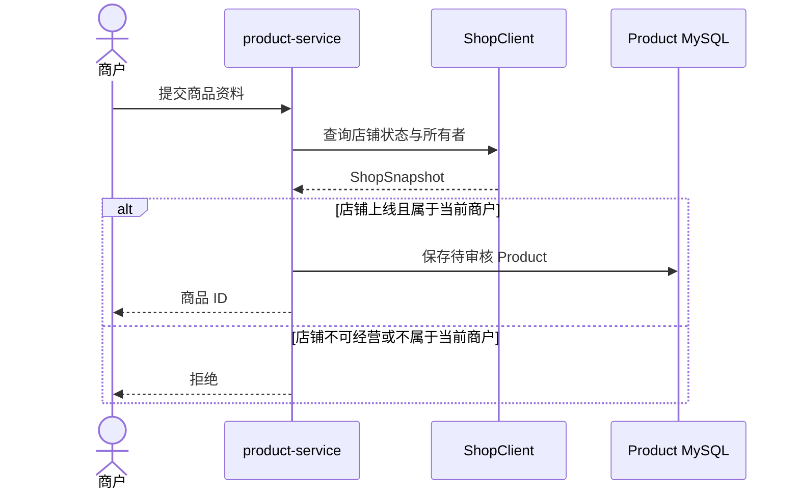
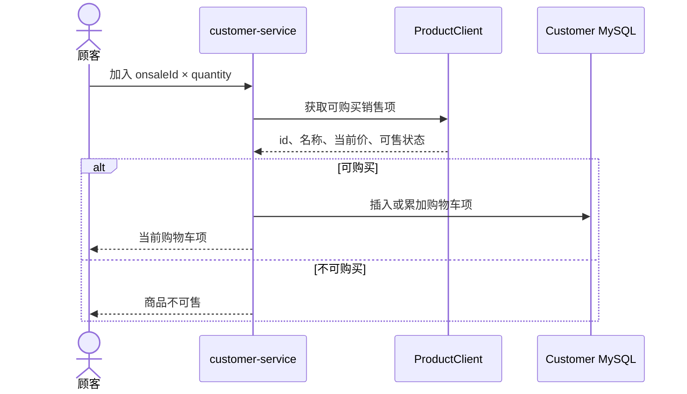
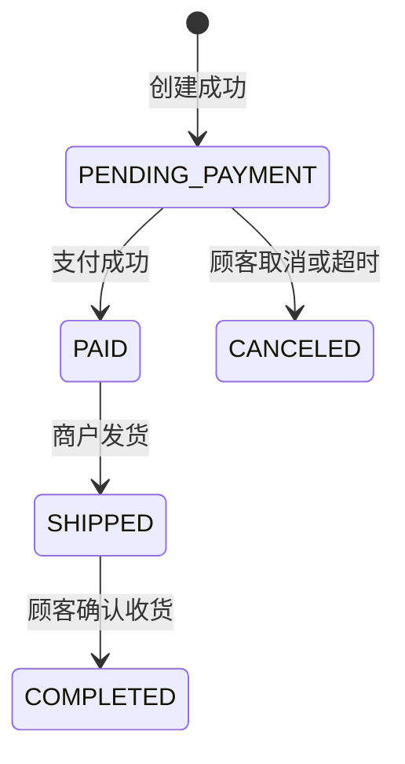
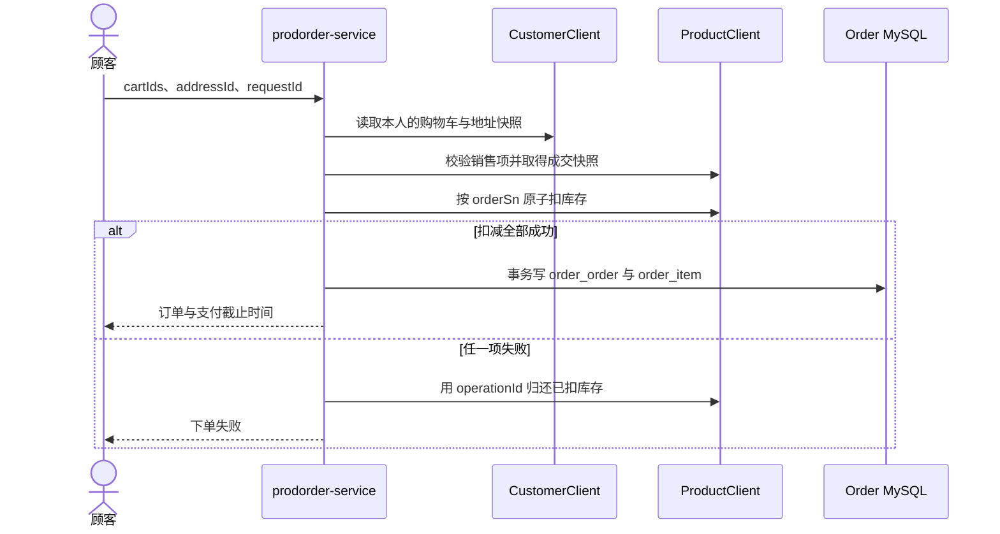
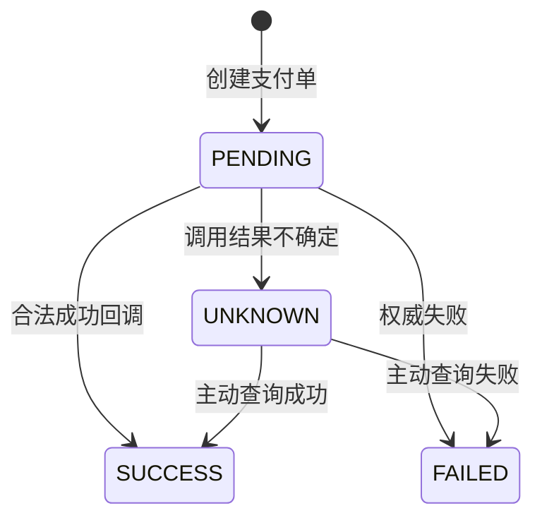
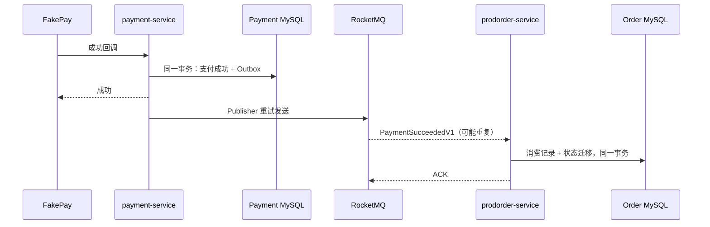
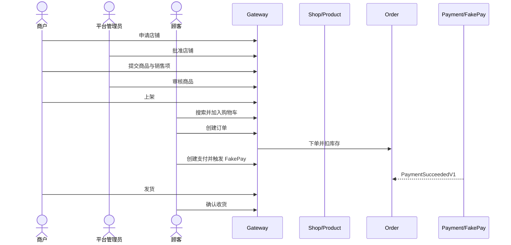

# tiny-oomall 开发实验手册

> 适用对象：刚毕业、具备 Java 基础，希望按团队开发方式完成 Spring Boot 商城项目的开发人员。
> 配套设计：[精简商城系统设计与实现指导书](simple-mall-engineering-lab.md)、[需求分析、用例与 UML](requirements-and-uml.md)。

## 1. 如何使用本手册

本手册按可运行、可测试、可评审的顺序安排开发工作。每个实验先给出业务结果，再说明实现内容、技术知识、测试方法和独立运行条件。完成一个实验的标准不是“代码写完”，而是：正常路径与失败路径都有自动化测试，接口契约可查，服务能独立启动，评审者能根据验收场景复现结果。

系统只包含顾客、商户、平台管理员和支付平台参与的最小交易闭环：

```text
商户申请店铺 → 平台审核 → 商户发布商品
→ 顾客加入购物车 → 创建订单并扣库存 → 支付
→ 商户发货 → 顾客确认收货
```

不实现物流系统、运费计算、优惠、退款、售后、仓储和配送轨迹。收货地址是订单中的普通文本快照。

### 1.1 开发前应理解的几个概念

- **模块**是 Maven 构建边界，例如 `core`；**微服务**是可独立启动、独立部署并拥有自身数据的运行单元，例如 `product-service`。不是每个模块都应成为微服务。
- **Controller** 处理 HTTP 协议和参数校验；**Application Service** 编排一次用例；**Domain** 保存业务规则；**Repository/Mapper** 负责数据访问。Controller 不应直接调用 Mapper。
- **本地事务**只能保证一个数据库内的操作原子完成，不能同时保证另一个服务、Redis、RocketMQ 或 Elasticsearch 成功。
- **契约**不只是 URL。请求字段、响应字段、HTTP 状态、业务错误码和幂等键都属于契约。
- **单元测试**验证一个类的规则；**集成测试**连接真实 MySQL、Redis 或 Elasticsearch；**契约测试**固定服务之间的接口；**端到端测试**从 Gateway 走完整业务链。
- 金额统一使用整数“分”，不能使用 `double`。时间在 Java 中使用 `Instant` 或明确时区的类型，接口使用 ISO-8601。

### 1.2 模块边界与独立运行结论

| 模块 | 运行形态 | 是否独立微服务 | 独立测试时需要的替身 |
| --- | --- | --- | --- |
| `core` | 公共 Maven Library | 否 | 无 |
| `customer` | `customer-service` | 是 | 购物车实验需要假的 `ProductClient` |
| `shop` | `shop-service` | 是 | 无 |
| `product` | `product-service` | 是 | 假的 `ShopClient` |
| `prodorder` | `prodorder-service` | 是 | 假的 `CustomerClient`、`ProductClient` |
| `payment` | `payment-service` | 是 | FakePay、假的 `OrderClient` |
| `elasticsearch` | `elasticsearch-service` | 是 | 测试事件生产者或固定索引数据 |
| `gateway` | API Gateway | 可独立进程，不是业务服务 | WireMock 或已启动的上游服务 |

“可以独立”不表示完全没有依赖，而是依赖均经过公开契约，测试时可被 Stub/WireMock 替代；该服务不得直接读取其他服务的表。

### 1.3 本地启动与结束 `customer` 服务

当前已实现并可运行的是 `customer` 服务。根目录的 `tiny-oomall` 是 Maven 聚合工程，没有 Spring Boot 启动类，因此不要在根目录执行 `mvn spring-boot:run`。

首次运行或 Kubernetes 基础设施尚未创建时，先在项目根目录执行：

```bash
kubectl apply -f k8s/infrastructure.yaml
kubectl -n tiny-oomall wait --for=condition=ready pod -l app=mysql --timeout=180s
```

推荐使用脚本一键启动 customer。脚本会创建或复用 Kubernetes 基础设施，等待 MySQL 和 Redis 就绪，启动两个端口转发，编译并后台启动 customer：

```bash
./scripts/start-customer.sh
```

日志写入系统临时目录下的 `tiny-oomall/customer.log`。启动后可检查：

```bash
curl http://127.0.0.1:8081/actuator/health
```

结束本次开发时执行：

```bash
./scripts/stop-customer.sh
```

关闭脚本只停止本地 customer 进程和端口转发，不会删除 Kubernetes 中的 MySQL、Redis 或数据卷。

如需手动启动，打开三个终端，以下命令都从项目根目录执行。前两个终端分别保持 MySQL 和 Redis 的端口转发：

```bash
kubectl -n tiny-oomall port-forward service/mysql 13306:3306
```

```bash
kubectl -n tiny-oomall port-forward service/redis 16379:6379
```

在第三个终端构建并启动服务：

```bash
mvn -pl core,customer -am package -DskipTests
env SPRING_DATASOURCE_URL='jdbc:mysql://localhost:13306/customer?useUnicode=true&characterEncoding=utf8&serverTimezone=UTC' REDIS_PORT=16379 \
  java -jar customer/target/customer-0.1.0-SNAPSHOT.jar
```

服务启动完成后验证健康状态：

```bash
curl http://127.0.0.1:8081/actuator/health
```

预期返回 `{"status":"UP"}`。服务地址是 `http://127.0.0.1:8081`，业务 API 均以 `/api` 开头。

结束本次开发时，在上述三个终端中分别按 `Ctrl-C`：第三个终端停止 `customer`，另外两个终端停止端口转发。这样不会删除 Kubernetes 中的 MySQL、Redis 数据。只有确认要清除本地基础设施和数据卷时，才执行：

```bash
kubectl delete -f k8s/infrastructure.yaml
```

## 2. API 约定与实验总览

API 必须在对应业务模块编码前完成评审。服务内 Path 必须能从“资源名 + 动作语义”直接判断用途：普通资源创建、查询可使用复数名词，例如 `POST /customers`；申请、审核、上线等工作流动作必须使用 `shop-applications`、`review`、`online` 这类明确名称，不能只写 `POST /shops` 让调用者猜测它是申请、创建还是后台导入。Gateway 对外统一增加 `/api` 前缀并在转发时移除，例如服务内 `POST /shop-applications` 对外是 `POST /api/shop-applications`。角色仍从登录身份判断，不以 URL 中的角色名称作为授权依据。

每张 API 表的“来源”有三种取值：

- **OOMALL 保留**：Method 和服务内 Path 与 OOMALL Controller 一致，删除范围外字段后继续使用；
- **OOMALL 适配**：保留 OOMALL 的资源命名和操作语义，但因本项目没有地区、物流、优惠等功能而简化 DTO 或状态；
- **闭环补充**：OOMALL 当前模块没有可用实现，但最小交易闭环必须有。接口仍遵守已有资源命名，并明确给出新增原因。

Controller 只完成参数校验、读取 `UserContext`、调用 Application Service 和组装 `ReturnObject`。表中“处理逻辑”描述的是完整用例，不表示把这些步骤都写在 Controller 中。

### 2.1 响应、错误码与分页

响应字段沿用 OOMALL [`ReturnObject`](../../oomall/core/src/main/java/cn/edu/xmu/javaee/core/model/ReturnObject.java) 的 `errNo`、`errMsg`、`data`，增加排障所需的 `requestId`：

```json
{
  "errNo": 0,
  "errMsg": "成功",
  "data": {},
  "requestId": "01J..."
}
```

分页响应统一为 `data.list`、`data.page`、`data.pageSize`、`data.total`。页码从 1 开始，`pageSize` 默认 10、最大 100。列表为空返回空数组，不返回 `null`。每张 API 表的“成功响应”列必须列出 `data` 的 DTO 名称；紧随表格定义 DTO 的所有属性，不能只写“返回店铺信息”。

优先复用 OOMALL `ReturnNo` 中与当前范围有关的编号，但明确 HTTP Status：

| errNo | 名称 | HTTP Status | 使用场景 |
| --- | --- | --- | --- |
| 0 | OK | 200/204 | 查询、修改、删除成功 |
| 1 | CREATED | 201 | 创建成功 |
| 2 | INTERNAL_SERVER_ERR | 500 | 未知服务端错误，响应不泄露堆栈 |
| 3 | FIELD_NOTVALID | 400 | Bean Validation 或参数组合错误 |
| 4 | RESOURCE_ID_NOTEXIST | 404 | 资源不存在 |
| 7 | STATENOTALLOW | 409 | 当前状态不允许操作 |
| 17 | RESOURCE_ID_OUTSCOPE | 403 | 已登录但资源不属于当前主体 |
| 32 | NEED_LOGIN | 401 | 未登录或 Session 过期 |
| 199 | SHOP_USER_HASSHOP | 409 | 商户重复申请店铺 |
| 296 | GOODS_STOCK_SHORTAGE | 409 | 库存不足 |
| 297 | GOODS_ONSALE_NOTEFFECTIVE | 409 | 销售项不可购买 |
| 299 | GOODS_ONSALE_CONFLICT | 409 | 销售时段冲突 |
| 601 | ADDRESS_OUTLIMIT | 409 | 地址数量达到上限 |
| 609/610/613/615 | Customer 相关错误 | 401/403/409 | 凭证、停用、手机号重复、不可加购 |

OOMALL 部分业务错误默认返回 HTTP 200，其测试也据此断言。tiny-oomall 保留 `errNo`，但使用上表更明确的 HTTP Status；参考测试时必须同时更新状态断言，不能出现错误响应仍为 200 的混合风格。

### 2.2 API 测试的统一写法

OOMALL 的 Shop、Product、Payment Controller Test 普遍采用：

```java
@SpringBootTest(classes = ShopApplication.class)
@AutoConfigureMockMvc
@Transactional
class ShopControllerTest {
    @Autowired MockMvc mockMvc;
}
```

测试通过 Header 构造不同角色的 `UserToken`，用 MockMvc 发起真实 JSON 请求，并断言 HTTP Status、`errNo` 和 `data`。tiny-oomall 保留这个测试形态，同时遵守以下规则：

1. 每个写 API 至少有成功、参数错误、未登录、角色错误、资源越权、状态错误六类用例；不适用的类别在测试清单说明原因。
2. 成功和失败都要查询 Repository，证明数据确实提交或确实没有变化。只检查 `errNo` 不足以验收事务与幂等。
3. Controller Test 可 Mock Redis、Feign Client 和支付渠道以聚焦 HTTP；另建 Testcontainer Integration Test 验证真实 MySQL/Redis/Elasticsearch 行为。
4. 测试自行准备并清理 Fixture，不依赖 OOMALL SQL 中的固定 id。通过事务回滚清理 MySQL 时，要注意 Redis、MQ 和 Elasticsearch 不会随数据库事务回滚。
5. 并发、MQ 重试、缓存 TTL、唯一键等不能由 MockMvc 单独证明，必须使用真实基础设施和可重复的并发测试。

参考入口：[`ShopControllerTest`](../../oomall/shop/src/test/java/cn/edu/xmu/oomall/shop/controller/ShopControllerTest.java)、[`ShopProductControllerTest`](../../oomall/product/src/test/java/cn/edu/xmu/oomall/product/controller/ShopProductControllerTest.java)、[`InternalControllerTest`](../../oomall/payment/src/test/java/cn/edu/xmu/oomall/payment/controller/InternalControllerTest.java)。

### 2.3 实验总览

| 顺序 | 实验 | 本阶段可交付的业务能力 | 主要技术 | 主要测试 |
| --- | --- | --- | --- | --- |
| 0 | 工程与环境基线 | 多模块构建、健康检查、数据库迁移 | Maven、Spring Boot、Kubernetes、Flyway | Context、容器 Smoke Test |
| 1 | `customer` 用户与认证 | 注册、登录、退出、地址管理；产生第一批 `core` 能力 | MySQL、Spring Security、Redis | Unit、MySQL/Redis Integration、API |
| 2 | `shop` 店铺 | 申请、审核、上线、下线；补充分页和审计能力 | MySQL、状态机、事务 | Domain、Repository、MockMvc |
| 3 | `product` 商品与销售项 | 类目、草稿、审核、销售项、查询 | MySQL、MyBatis、OpenFeign | Domain、SQL Integration、Contract |
| 4 | `product` 库存与缓存 | 原子扣减/归还、商品缓存 | MySQL 条件更新、Redis、Cache Aside | 并发、Redis Integration、故障降级 |
| 5 | `customer` 购物车 | 加购、改数量、删除、结算候选项 | MySQL、Feign、快照 | Unit、API、Contract |
| 6 | `prodorder` 订单 | 创建、取消、超时、发货、收货 | 本地事务、状态机、Feign | Domain、Integration、API |
| 7 | `payment` 支付 | 支付单、FakePay、回调幂等、查询 | Adapter、MySQL、Redis | Unit、API、幂等与安全测试 |
| 8 | 跨服务一致性 | 支付确认、库存归还、搜索同步 | RocketMQ、Outbox、消费幂等 | MQ Integration、故障恢复 |
| 9 | `elasticsearch` 搜索 | 关键词搜索、索引更新与重建 | Elasticsearch、Spring Data ES | Mapping、Query、Rebuild |
| 10 | `gateway` 与注册发现 | 统一入口、路由、Request ID | Nacos、Spring Cloud Gateway | Route、Auth、Contract |
| 11 | 质量门禁与部署 | CI、镜像、整套环境、观测与演练 | JUnit、Testcontainers、Docker、Actuator | E2E、回归、故障演练 |

在实验 1、2、3、6、7、9 完成后，都应能单独启动相应微服务。实验 8 和 10 负责把已经存在的服务连成系统，不用等到最后才验证模块边界。

## 3. 实验 0：工程与本地环境基线

### 3.1 要完成什么

建立根 Maven 工程和 `customer`、`shop`、`product`、`prodorder`、`payment`、`elasticsearch`、`gateway` 模块。业务模块使用独立 Spring Boot 启动类。暂不建立包含大量预想类型的 `core`；实验 1 写出第一个业务接口、确认出现跨模块复用点后，再加入只打包为 Jar 的 `core`。先让每个服务暴露 `/actuator/health`，此时不要求存在业务接口。

建立本地基础设施编排：MySQL、Redis、RocketMQ NameServer/Broker、Elasticsearch、Nacos。业务服务暂时只连接 MySQL；其他组件到实际需要的实验再接入。这样可以先证明环境可用，又不会在不了解用途时堆配置。

数据库按服务分 Schema 或独立账号：

```text
customer → customer_customer, customer_address, customer_cart
shop     → shop_shop
product  → goods_category, goods_product_draft, goods_product,
           goods_onsale, stock_operation_record
prodorder→ order_order, order_item, event_consume_record
payment  → payment_pay_trans, event_publish_record
```

表名沿用 OOMALL，字段在具体业务实验中逐步加入。每个服务用 Flyway 管理自己的迁移，不允许服务启动时依赖人工复制 SQL。

### 3.2 需要掌握的技术

- Maven Parent 聚合模块、`dependencyManagement` 与插件版本；
- Spring Boot Profile：`local`、`test`、`prod`；
- Kubernetes 的 Deployment、StatefulSet、Service、PVC、ConfigMap、Secret 与 Probe；
- Flyway 版本迁移：已经执行的迁移不可改写，只能新增版本；
- Spring Boot Actuator 健康检查。

版本要集中管理并形成兼容组合，尤其是 Spring Boot、Spring Cloud、Spring Cloud Alibaba 和 Java。不要在每个模块重复写版本号。

### 3.3 测试与验收

```bash
./mvnw -q clean verify
kubectl apply -f k8s/infrastructure.yaml
kubectl -n tiny-oomall get pods
./mvnw -pl customer spring-boot:run -Dspring-boot.run.profiles=local
curl http://localhost:8081/actuator/health
```

验收时应证明：全新数据库可由迁移创建；重复启动不重复建表；错误密码会使服务启动失败；每个 Spring Boot 模块的 Context Test 通过；配置中没有提交真实密钥。

### 3.4 OOMALL 参考

- 基础设施清单与网络关系：本仓库的 [`k8s/infrastructure.yaml`](../k8s/infrastructure.yaml)。
- MySQL 初始化入口：[init-data.sh](../../oomall/conf/mysql/init-data.sh)。tiny-oomall 使用 Flyway 后，不照搬其整库导入方式。
- OOMALL 各服务的 `application.yaml` 与 `bootstrap.yaml` 可用于识别端口、注册发现和配置中心的职责。

**独立微服务判断：**此实验只有可启动的空服务和公共 Library，还没有具备业务价值的微服务。

## 4. 实验 1：`customer` 用户、认证与地址

### 4.1 业务结果

顾客可以注册、登录、退出，维护自己的收货地址。平台管理员和商户测试账号可由迁移脚本初始化。当前阶段不实现购物车，因为商品销售项尚未出现。

### 4.2 编码前确定 API

OOMALL 当前仓库没有 `customer` Java 模块，只有 [`customer.sql`](../../oomall/conf/mysql/sql/customer.sql)，所以下列接口来自 tiny-oomall 最小闭环，而不是声称 OOMALL 已经实现。资源名使用 OOMALL 的 `customer_customer`、`customer_address`。

| Method | 服务内 Path | 角色 | 功能描述 | 请求与成功结果 | 必须实现的逻辑 | 主要失败 |
| --- | --- | --- | --- | --- | --- | --- |
| POST | `/customers` | 匿名 | 创建顾客账号 | mobile、password、name；201 返回 Customer 简要信息 | 规范化手机号，检查唯一，BCrypt 编码密码，保存正常状态用户 | 字段非法、手机号重复 |
| POST | `/auth/sessions` | 匿名 | 使用手机号和密码登录，建立会话 | mobile、password；201 返回 Session ID 与过期时间 | 查询用户，验证状态和密码，生成随机 Session ID，写 Redis TTL | 凭证错误 401、账号停用 403、Redis 不可用 503 |
| DELETE | `/auth/sessions/current` | 顾客 | 退出当前登录会话 | 无；204 | 从认证信息取得 Session ID，删除 Redis Key；重复退出仍成功 | 无有效身份时 401 |
| GET | `/addresses` | 顾客 | 分页查看自己的收货地址 | 分页返回自己的地址 | 查询条件强制带当前 `customer_id`，不接受客户端传 customerId | 未登录、分页非法 |
| POST | `/addresses` | 顾客 | 新增一条收货地址 | consignee、mobile、address、beDefault；201 返回地址 | 保存地址；设为默认时同一事务清除旧默认 | 字段非法、超过地址上限 |
| PUT | `/addresses/{id}` | 顾客 | 修改自己已有的收货地址 | 可修改字段；200 返回修改后地址 | 先以 `id + 当前 customer_id` 查找，再修改；切换默认地址使用事务 | 不存在或不属于本人均按资源不可访问处理 |
| DELETE | `/addresses/{id}` | 顾客 | 删除自己的一条收货地址 | 204 | 只删除当前顾客的地址；删除默认地址后不自动猜测新默认地址 | 不存在、越权 |
| GET | `/internal/customers/{customerId}/addresses/{id}` | 内部服务 | 为订单等服务读取指定顾客的地址快照 | 返回 AddressSnapshot | 校验调用方身份，以 customerId 和 id 同时查询，供订单保存快照 | 地址不存在、客户不匹配 |

对外路径为表中路径加 `/api`，例如 `POST /api/customers`。购物车接口等到商品销售项存在后再定义。

### 4.3 实现内容与规则

`customer_customer` 使用 `id, mobile, password, name, status` 和审计字段。字段命名沿用 OOMALL；其中 `status` 是对 OOMALL `invalid`、`be_deleted` 的精简表达。`mobile` 必须唯一，密码只保存 BCrypt Hash。

`customer_address` 使用：`id, customer_id, address, consignee, mobile, be_default` 和审计字段。不引入 `region_id`。一个顾客最多一个默认地址；设置新默认地址时，在同一个数据库事务中清除旧默认地址。

登录成功后生成不可预测的 Session ID，以 `session:{id}` 为 Key 把 `UserToken` 写入 Redis，并设置过期时间。客户端 Cookie 或 Header 只携带 Session ID，不携带可被篡改的完整用户 JSON。退出登录删除 Key。



### 4.4 随业务提取第一批 `core`

写注册接口时会立即遇到“成功响应怎么表示、字段错误怎么表示”；写登录和地址接口时又会遇到“当前用户放在哪里”。此时才把重复能力提取到 `core`：

- `ReturnObject<T>` 与 `ReturnNo`：由注册、登录、地址接口的真实响应需求产生；
- `BusinessException` 与 `GlobalExceptionHandler`：处理手机号重复、凭证错误、地址越权；
- `UserToken`、`UserContext`：认证过滤器解析 Session 后保存当前用户；
- Jackson 时间配置和审计基类。

OOMALL 的 [`ControllerAspect`](../../oomall/core/src/main/java/cn/edu/xmu/javaee/core/aop/ControllerAspect.java) 集中处理业务异常和 HTTP 状态：

```java
try {
    retVal = (ReturnObject) jp.proceed(newArgs);
} catch (BusinessException exception) {
    retVal = new ReturnObject(exception.getErrno(),
            getI18nMessage(exception, messageSourceAccessor));
}
response.setStatus(retVal.getCode().getHttpStatus());
```

tiny-oomall 可先在 `customer` 中验证，再提取为 `@RestControllerAdvice`。只有第二个业务模块也需要的类型才进入 `core`；用户注册规则、地址归属规则不能进入公共模块。参考 [`ReturnObject`](../../oomall/core/src/main/java/cn/edu/xmu/javaee/core/model/ReturnObject.java)、[`ReturnNo`](../../oomall/core/src/main/java/cn/edu/xmu/javaee/core/model/ReturnNo.java) 和 [`UserContext`](../../oomall/core/src/main/java/cn/edu/xmu/javaee/core/util/UserContext.java)。

### 4.5 技术说明

MySQL 保存不可丢失的用户与地址事实；Redis 只保存可重建、会过期的登录状态。Redis 宕机时不能绕过认证，应返回明确的服务不可用错误。Spring Security 负责认证过滤器与角色判断，资源归属仍要在业务查询中使用 `customer_id` 条件限制。

`customer` 模块使用 MyBatis XML Mapper 访问 MySQL，而不使用 JPA 或 Hibernate。Mapper 接口位于 `customer.repository`，SQL 位于 `customer/src/main/resources/mapper/`；`CustomerRepository.xml` 负责顾客注册与登录查询，`AddressRepository.xml` 负责地址的归属查询、分页、更新和删除。Flyway 是表结构的唯一管理者，实体类是普通 JavaBean，不依赖持久化注解。插入 `customer_customer`、`customer_address` 时，Mapper 的 `useGeneratedKeys="true"` 和 `keyProperty="id"` 会将 MySQL 的自增主键回填到 Java 对象。

MyBatis 不提供 JPA 的脏检查：修改地址后，Service 必须显式调用 `addresses.update(customerAddress)`；地址分页也由 Mapper 使用 `LIMIT`、`OFFSET` 查询，再由 Service 组装 `Page`。`@Transactional` 仍然有效，MyBatis 会参与 Spring 的数据源事务，因此清除旧默认地址和保存新默认地址会一起提交或回滚。

### 4.6 测试与验收

- `Customer` 单元测试：停用账号不能登录；密码不会以明文返回；
- Testcontainers MySQL：唯一索引、默认地址事务、只能操作自己的地址；
- Testcontainers Redis：Session TTL、退出后失效、过期后返回 401；
- MockMvc：注册参数校验、登录成功/失败、越权访问他人地址；
- 安全测试：响应和日志不出现密码 Hash，伪造 Session ID 不生效。

模块验收命令示例：

```bash
./mvnw -pl customer -am test
./mvnw -pl customer -Dtest='*ControllerTest,*RepositoryTest' test
```

**独立微服务判断：**是。完成用户和地址后，`customer-service` 只依赖自己的 MySQL 与 Redis，可独立启动和部署。

**OOMALL 参考：**表结构见 [`customer.sql`](../../oomall/conf/mysql/sql/customer.sql)；只参考 `customer_customer`、`customer_address`、`customer_cart`，忽略优惠券和分享表。由于没有可复用的 Customer Controller Test，本阶段的 API 测试按上表逐条建立，不能用其他模块测试冒充依据。

## 5. 实验 2：`shop` 店铺申请与审核

### 5.1 业务结果

商户申请一个店铺；平台管理员批准或拒绝申请；批准后的店铺可以上线或下线。顾客只能看到上线店铺。每个商户只能拥有一个未关闭店铺。

### 5.2 编码前确定 API

下表以明确工作流语义重命名 tiny-oomall 的 Path。OOMALL 的 [`ShopController`](../../oomall/shop/src/main/java/cn/edu/xmu/oomall/shop/controller/ShopController.java) 仍可用于参考参数校验、状态控制和测试结构。OOMALL 用 `@Audit(departName = "shops")` 取得并校验当前部门；tiny-oomall 使用前一阶段形成的 `UserContext`，并把商户 ID 与店铺 ID 的归属检查写进 Application Service。

| Method | 服务内 Path | 角色 | 功能描述 | 请求字段 | 成功响应 `data` | 必须实现的逻辑 | 主要失败 | 来源 |
| --- | --- | --- | --- | --- | --- | --- | --- | --- |
| GET | `/shop-status-options` | 匿名 | 查询可用于展示和筛选的店铺状态选项 | 无 | `ShopStatusOption[]` | 返回 code/name 状态列表，不暴露 Java Enum 名 | 无 | OOMALL 适配 |
| POST | `/shop-applications` | 商户 | 提交一份开店申请 | `name`、`contact`、`mobile` | 201，`ShopApplicationView` | 检查当前商户没有有效店铺、名称不重复；保存 `NEW` | 已有店铺、重名、字段非法 | OOMALL 适配 |
| GET | `/shops` | 匿名 | 分页浏览顾客可见的已上线店铺 | `name`、`page`、`pageSize` | `Page<PublicShopView>` | 按 name 分页查询；只返回 `ONLINE` 店铺和公开字段 | page/pageSize 非法 | OOMALL 适配 |
| GET | `/merchant/shop/management-detail` | 商户 | 查询当前商户自己店铺的管理详情，含审核信息 | 无 | `ShopManagementView` | 从 Session 取得 merchantId，再查询其店铺；商户不传 shopId | 不存在、越权 | OOMALL 适配 |
| GET | `/shops/{shopId}/management-detail` | 平台管理员 | 查询指定店铺的管理详情，含审核信息 | 无 | `ShopManagementView` | 按 shopId 查询；平台管理员可查看任意店铺 | 不存在、非平台身份 | OOMALL 适配 |
| PATCH | `/merchant/shop/detail` | 商户 | 修改当前商户自己店铺的名称和联系信息 | `name`、`contact`、`mobile` | `ShopManagementView` | 从 Session 取得 merchantId；状态和审核字段不可从 DTO 写入 | 不存在、越权、重名 | OOMALL 适配 |
| GET | `/shop-review-queue` | 平台管理员 | 分页查看平台待处理及历史店铺申请 | `status`、`name`、`page`、`pageSize` | `Page<ShopManagementView>` | 按 status/name 分页查全部状态；不再让无意义的 `{id}/shops` 承担平台列表 | 非平台身份、分页非法 | OOMALL 适配 |
| PUT | `/shop-applications/{shopId}/review` | 平台管理员 | 批准或拒绝指定开店申请 | `conclusion`、`reason` | `ShopManagementView` | `true`：`NEW → OFFLINE`；`false`：`NEW → REJECTED` 并保存 rejectReason | 商户自审、重复审核、拒绝无原因 | OOMALL 适配 |
| PUT | `/merchant/shop/online` | 商户 | 将当前商户自己的已批准店铺上线 | 无 | `ShopManagementView` | 从 Session 取得 merchantId；`OFFLINE → ONLINE`；上线前检查审核已通过 | 不存在、状态不允许 | OOMALL 保留 |
| PUT | `/merchant/shop/offline` | 商户 | 将当前商户自己的店铺下线并停止公开展示 | 无 | `ShopManagementView` | 从 Session 取得 merchantId；`ONLINE → OFFLINE`，不删除商品和历史订单 | 不存在、状态不允许 | OOMALL 保留 |
| PUT | `/shops/{shopId}/offline` | 平台管理员 | 将指定店铺下线并停止公开展示 | 无 | `ShopManagementView` | 按 shopId 查询；`ONLINE → OFFLINE`，不删除商品和历史订单 | 不存在、非平台身份、状态不允许 | OOMALL 保留 |
| GET | `/internal/shops/{shopId}` | product/prodorder | 向内部服务读取店铺经营快照 | 无 | `ShopSnapshot` | 供订单与商品服务判断店铺是否可经营 | 非内部调用、不存在 | 闭环补充 |

成功响应统一包在 `ApiResponse.data` 中。上述 DTO 的字段如下：

| DTO | `data` 属性 |
| --- | --- |
| `ShopStatusOption` | `code`、`name` |
| `ShopApplicationView` | `id`、`merchantId`、`name`、`contact`、`mobile`、`status`、`createdAt` |
| `PublicShopView` | `id`、`name`、`contact`、`mobile`、`status` |
| `ShopManagementView` | `id`、`merchantId`、`name`、`contact`、`mobile`、`status`、`rejectReason`、`auditorId`、`auditedAt`、`createdAt`、`updatedAt` |
| `ShopSnapshot` | `id`、`merchantId`、`status`、`canOperate` |

`Page<T>` 的 `data` 固定包含 `list`、`page`、`pageSize`、`total`；其中 `list` 中每个元素的属性由 `T` 决定。`204 No Content` 的成功响应没有 `data`，本实验 2 的接口则均返回变更后的资源，便于客户端立即刷新界面。

OOMALL 的 `updateShopAudit` 对 `conclusion=false` 没有实际状态修改；tiny-oomall 必须完成拒绝分支，因为商户需要看到结果并修正后重提。这是对已有 API 的补全，不增加新的业务范围。

申请 DTO 使用本项目简化后的店铺名称与联系信息；不沿用 OOMALL 嵌套的 `consignee`，以免它看起来像收货地址：

```json
{
  "name": "校园书店",
  "contact": "张三",
  "mobile": "13800000000"
}
```

审核 DTO 以 OOMALL `conclusion` 为核心；拒绝时 `reason` 必填，通过时忽略 reason：

```json
{ "conclusion": false, "reason": "店铺名称与已有店铺重复" }
```

### 5.3 状态与规则



状态迁移由 `Shop` 领域对象判断，Controller 不能直接赋值状态。`shop_shop` 使用 `id, merchant_id, name, contact, mobile, status, reject_reason, auditor_id, audit_time` 和审计字段；`merchant_id` 建唯一索引。`contact` 与 `mobile` 是店铺联系信息，不用于物流；OOMALL 中的 `region_id`、`free_threshold` 和经营地址不进入本项目。

OOMALL 的 [`Shop`](../../oomall/shop/src/main/java/cn/edu/xmu/oomall/shop/dao/bo/Shop.java) 展示了状态前置条件：

```java
public void online() {
    if (!this.status.equals(OFFLINE)) {
        throw new BusinessException(ReturnNo.STATENOTALLOW);
    }
    this.changeStatus(ONLINE);
}
```

这里应借鉴“对象保护状态迁移”。tiny-oomall 的领域对象只修改自身状态，由 Application Service 调用 Repository 保存，避免把 `ShopDao` 注入实体。

### 5.4 测试与验收

- Domain Unit Test 覆盖状态图上的合法边和非法边；
- Repository Integration Test 覆盖 `merchant_id` 唯一约束和并发重复申请；
- MockMvc 覆盖商户申请、管理员审核、商户上线、顾客列表；
- 权限矩阵：顾客不能申请店铺，商户不能审核，管理员不能冒充商户上线，商户不能操作别人的店铺；
- 响应断言同时检查 HTTP Status、业务码和数据库最终状态。

OOMALL 的 [`ShopControllerTest`](../../oomall/shop/src/test/java/cn/edu/xmu/oomall/shop/controller/ShopControllerTest.java) 展示了使用 `@SpringBootTest + MockMvc` 验证角色和接口结果的方式：

```java
mockMvc.perform(post("/shop-applications")
        .header("authorization", shopToken)
        .contentType(APPLICATION_JSON)
        .content(body))
    .andExpect(status().isCreated())
    .andExpect(jsonPath("$.data.name").value("测试商铺001"));
```

按 OOMALL 测试逐项建立 tiny-oomall 验收矩阵：

| API | 直接参考的 OOMALL 用例 | tiny-oomall 还要补充 |
| --- | --- | --- |
| POST `/shop-applications` | `testCreateShopsWhenUserIsAdmin`、`testCreteShopWhenUserHasNoShop`、`testCreteShopWhenUserHasShop` | 名称并发重复、请求字段校验、响应包含申请状态 `NEW` |
| GET `/shops` | `testRetrieveShopsGivenParam`、`testRetrieveShopsWithoutParam` | 只返回 ONLINE，不返回 NEW/OFFLINE/REJECTED；分页边界 |
| PATCH `/merchant/shop/contact` | Redis 命中/未命中、无店铺、ABANDON 状态用例 | 从 Session 取得商户店铺、DTO 不能篡改 status |
| GET `/merchant/shop/management-detail`、`/shops/{shopId}/management-detail` | 当前商户、指定店铺查询用例 | 未登录、无店铺、非平台管理员 |
| GET `/shop-review-queue` | 平台成功与普通商户失败用例 | status/name 组合分页 |
| PUT `/shop-applications/{shopId}/review` | 商户审核失败、管理员成功、错误状态用例 | 拒绝原因、拒绝后重提、两管理员并发审核仅一人成功 |
| PUT `/merchant/shop/online`、`/merchant/shop/offline`、`/shops/{shopId}/offline` | 正确状态与错误状态用例 | 当前商户定位、管理员权限、重复请求幂等语义 |
| GET `/shop-status-options` | [`UnAuthorizedShopControllerTest`](../../oomall/shop/src/test/java/cn/edu/xmu/oomall/shop/controller/UnAuthorizedShopControllerTest.java) | code/name 完整且无需登录 |

OOMALL 测试大量使用事务回滚并 Mock Redis。tiny-oomall 的 Controller Test 可以沿用这种结构，但至少再保留一组 MySQL Testcontainer 测试，验证唯一索引、并发审核和真实提交结果。

本阶段出现列表查询和统一审计字段后，再向 `core` 增加 `PageDto<T>`、分页参数上限检查和审计填充器。`ShopStatus`、`ShopAuditCommand` 等店铺概念仍留在 `shop`，不能为了“复用”放进 `core`。

**独立微服务判断：**是。`shop-service` 只拥有 `shop_shop`。测试中从认证 Header 构造 `UserToken`；不连接 `customer` 数据库。

## 6. 实验 3：`product` 类目、商品与销售项

### 6.1 业务结果

平台管理员维护商品类目。上线店铺的商户提交商品；管理员审核商品；审核通过后，商户建立销售项，设置价格、库存和销售时间并上架。顾客查询到的是当前可购买的销售项，不是尚未定价的商品资料。

### 6.2 为什么分开 Product 与 OnSale

`Product` 表示稳定的商品资料，`OnSale` 表示在某店铺、某时间以某价格出售多少件。分开后，商品名称审核和价格库存变化不会混在一个状态里，也能在订单中准确记录 `onsale_id`。

沿用以下 OOMALL 表和字段：

```text
goods_category: id, pid, name, status, audit fields
goods_product : id, shop_id, category_id, name, original_price, unit,
                description, status, reject_reason, auditor_id, audit_time,
                audit fields
goods_onsale  : id, product_id, price, quantity, max_quantity,
                begin_time, end_time, status, version, audit fields
```

不使用活动、佣金、物流模板、重量、产地、免邮门槛等字段。`original_price` 和 `price` 都以分为单位。

### 6.3 编码前确定 API

商品模块只选取 OOMALL 的 Category、DraftProduct、Product、OnSale 接口。活动、团购、优惠券、商品关系、物流模板和佣金接口不进入本项目。

#### 顾客与公共查询

| Method | 服务内 Path | 功能描述 | 必须实现的逻辑 | 主要失败 | 来源 |
| --- | --- | --- | --- | --- | --- |
| GET | `/products/states` | 获取商品状态选项 | 返回商品状态 code/name | 无 | OOMALL 保留 |
| GET | `/products` | 分页浏览可公开销售的商品 | 按 productId/name/page/pageSize 查询可公开商品；不得返回待审核或禁售项 | 分页非法 | OOMALL 保留 |
| GET | `/products/{id}` | 查看单个公开商品的资料 | 查询商品资料；顾客结果只包含已通过商品 | 不存在、不可公开 | OOMALL 保留 |
| GET | `/onsales/{id}` | 查看销售项价格、库存和可购买状态 | 返回销售项、商品名、现价、剩余量和销售时间；判断当前是否可购买 | 不存在；过期/售罄仍可返回但 `purchasable=false` | OOMALL 保留 |
| GET | `/categories/{id}/subcategories` | 浏览商品类目的直接子类目 | 查询直接子类目；根节点按约定 id 查询 | 父类目不存在 | OOMALL 保留 |

#### 商户操作

| Method | 服务内 Path | 功能描述 | 必须实现的逻辑 | 主要失败 | 来源 |
| --- | --- | --- | --- | --- | --- |
| POST | `/draftproducts` | 创建待审核的商品草稿 | 校验店铺为 ONLINE、类目有效；创建待审核商品，返回 201 | 店铺不可经营、类目不存在、字段非法 | OOMALL 适配 |
| GET | `/draftproducts` | 分页查看本店的商品草稿 | 按当前 shopId 分页查询自己的待审/驳回商品 | 越权、分页非法 | OOMALL 保留 |
| GET | `/draftproducts/{id}` | 查看本店指定草稿详情 | 查询自己的草稿详情 | 不存在、他店草稿 | OOMALL 保留 |
| PUT | `/draftproducts/{id}` | 修改待审或被驳回的商品草稿 | 仅待审或驳回状态可修改资料，不能改 shopId/status/auditorId | 他店资源、状态不允许 | OOMALL 保留 |
| DELETE | `/draftproducts/{id}` | 删除尚未发布的商品草稿 | 仅未发布草稿可删除 | 他店资源、已发布 | OOMALL 保留 |
| PUT | `/products/{id}/apply` | 将修正后的驳回商品重新提交审核 | 驳回商品修正后重新进入待审核；记录修改人 | 他店商品、状态不允许 | OOMALL 保留 |
| GET | `/products/{id}/onsales` | 查看本店商品的全部销售项 | 查询本店指定商品的全部销售项 | 商品不属于本店 | OOMALL 保留 |
| POST | `/products/{id}/onsales` | 为已审核商品创建销售项 | 商品已批准；校验 price、quantity、begin/end、时段不重叠；创建销售项 | 时间非法、重叠、商品禁售、越权 | OOMALL 保留 |
| PUT | `/onsales/{id}/cancel` | 提前结束本店销售项 | 未开始则结束时间收缩到开始时刻，进行中则结束于当前时刻；清缓存并发事件 | 已结束、他店销售项 | OOMALL 保留 |

#### 平台管理员与内部协作

| Method | 服务内 Path | 功能描述 | 必须实现的逻辑 | 主要失败 | 来源 |
| --- | --- | --- | --- | --- | --- |
| GET | `/categories/{id}/subcategories` | 管理端查看类目的全部直接子类目 | 管理端可看到全部状态的直接子类目 | 非管理员 | OOMALL 保留 |
| POST | `/categories/{id}/subcategories` | 在指定类目下新建子类目 | 在父类目下新增直接子类目，名称在同级唯一 | 父类目不存在、重名 | OOMALL 保留 |
| PUT | `/categories/{id}` | 修改商品类目名称 | 修改类目名称 | 不存在、重名 | OOMALL 保留 |
| DELETE | `/categories/{id}` | 删除或停用未被使用的类目 | 仅无子类目且无商品引用时删除/停用 | 仍被使用 | OOMALL 保留语义 |
| PUT | `/draftproducts/{id}/publish` | 审核商品草稿并发布或驳回 | 管理员审核：通过则成为可建立 OnSale 的 Product；拒绝保存原因 | 非待审核、并发重复审核 | OOMALL 保留 |
| PUT | `/products/{id}/allow` | 解除商品禁售 | 解除禁售，回到允许销售状态 | 状态不允许 | OOMALL 保留 |
| PUT | `/products/{id}/prohibit` | 禁售商品并停止其销售项购买 | 禁售商品并使销售项不可购买、清缓存、发布变化事件 | 不存在、重复禁售 | OOMALL 保留 |
| POST | `/internal/onsales/snapshots` | 批量提供下单所需销售项快照 | 按 ID 批量返回成交快照；必须从 MySQL 读取事实 | 任一项不存在/不可售时返回逐项原因 | 闭环补充 |
| POST | `/internal/onsales/deduct` | 为订单原子扣减销售项库存 | 按 operationId/orderSn 原子扣库存，全部成功或明确补偿 | 库存不足、重复操作 | 闭环补充 |
| POST | `/internal/onsales/restore` | 按原操作幂等归还库存 | 按 operationId 幂等归还库存 | 原操作不存在、参数不符 | 闭环补充 |

OOMALL 将草稿存入 `goods_product_draft`。为了保持 API 语义清楚，本阶段也使用该表，但只保留 `id, shop_id, product_id, category_id, name, original_price, unit, description` 和审计字段；审核发布后写 `goods_product`。这比让 `/draftproducts` 暗中操作正式商品表更容易理解和测试。

草稿请求参考 OOMALL `ProductDraftDto`，去掉产地，增加简单描述：

```json
{
  "name": "Java 编程入门",
  "originalPrice": 6900,
  "categoryId": 12,
  "unit": "本",
  "description": "Spring Boot 入门教材"
}
```

销售项请求参考 OOMALL `OnSaleDto`，去掉预售的定金、尾款时间和活动类型：

```json
{
  "price": 5900,
  "quantity": 100,
  "maxQuantity": 5,
  "beginTime": "2026-09-01T00:00:00+08:00",
  "endTime": "2026-10-01T00:00:00+08:00"
}
```

### 6.4 实现流程



`ShopClient` 只调用 `shop-service` 的内部只读接口。定义 `ShopSnapshot(id, merchantId, status)`，不要共享 `Shop` 实体或直接查 `shop_shop`。

OOMALL 的 [`Product.createOnsale`](../../oomall/product/src/main/java/cn/edu/xmu/oomall/product/model/Product.java) 把禁售与时间重叠规则放在业务对象附近：

```java
if (this.status.equals(Product.BANNED)) {
    throw new BusinessException(ReturnNo.STATENOTALLOW);
}
if (this.onsaleRepository.hasOverlap(onsale)) {
    throw new BusinessException(ProductReturnNo.ONSALE_STATENOTALLOW);
}
```

tiny-oomall 可保留“未审核通过不能创建销售项”“同一商品的有效销售时段不得重叠”两条规则。Repository 查询由 Application Service 完成，再把判断结果交给领域对象，Domain 不依赖数据库接口。

### 6.5 测试与验收

- Unit：商品审核状态、销售时间、价格大于零、非法上下架；
- MySQL Integration：类目父子关系、销售时段重叠、按 `shop_id` 限制更新；
- Contract：WireMock 模拟店铺上线、下线、不存在和超时；
- API：顾客只能查询审核通过、当前时间有效且库存大于零的销售项；
- 故障：`shop-service` 超时时，提交商品失败且本地不留下半条数据。

可参考 [`OnSaleServiceTest`](../../oomall/product/src/test/java/cn/edu/xmu/oomall/product/application/OnSaleServiceTest.java) 的业务异常测试，但应补足边界值和数据库最终状态断言。

Controller 验收直接映射 OOMALL 用例：

- [`ShopProductControllerTest`](../../oomall/product/src/test/java/cn/edu/xmu/oomall/product/controller/ShopProductControllerTest.java)：OnSale 缓存命中/未命中、他店越权、不存在、时间为空、时间倒置、销售时段冲突、错误 Token、取消未开始/进行中/已结束；
- [`AdminDraftProductControllerTest`](../../oomall/product/src/test/java/cn/edu/xmu/oomall/product/controller/AdminDraftProductControllerTest.java)：草稿新增、类目为空、本人和他店查询、修改、删除、申请审核、管理员发布及错误状态；
- [`UnAuthorizedControllerTest`](../../oomall/product/src/test/java/cn/edu/xmu/oomall/product/controller/UnAuthorizedControllerTest.java)：公开商品查询、Redis 命中/未命中、不存在；
- [`AdminControllerTest`](../../oomall/product/src/test/java/cn/edu/xmu/oomall/product/controller/AdminControllerTest.java)：管理员查询、允许销售、禁售及资源不存在。

这些用例是最低线，不照搬固定数据库 ID。每个测试自行准备 Fixture，并同时断言 HTTP Status、业务码、响应字段和数据库状态。删除/取消销售项涉及消息的用例，还要覆盖发送失败后本地事实是否可恢复。

**独立微服务判断：**是。使用假的 `ShopClient` 后，`product-service` 可只连接自己的 MySQL 独立验收。

## 7. 实验 4：`product` 库存与 Redis 缓存

### 7.1 为什么现在引入 Redis

商品详情读多写少，若每次都访问 MySQL，会产生重复查询。此时才引入 Redis 保存短期商品详情缓存。库存仍以 MySQL 为准：缓存可以被删除或过期，不能成为唯一库存来源。

### 7.2 库存原子性

先读库存、在 Java 中减数量、再更新数据库，在并发下会超卖。扣减必须由一条条件 SQL 完成：

```sql
UPDATE goods_onsale
SET quantity = quantity - #{quantity},
    version = version + 1,
    gmt_modified = CURRENT_TIMESTAMP
WHERE id = #{onsaleId}
  AND quantity >= #{quantity}
  AND status = #{onSaleStatus};
```

受影响行数为 0 时，再区分销售项不存在和库存不足。归还库存使用 `stock_operation_record(operation_id, order_sn, operation_type, ...)` 唯一键防止重复归还；`operation_id` 由调用方提供。

OOMALL [`OnsaleService.incrQuantity`](../../oomall/product/src/main/java/cn/edu/xmu/oomall/product/application/OnsaleService.java) 展示了库存不足异常和修改后的缓存删除：

```java
Integer newQuantity = onsale.getQuantity() + quantity;
if (newQuantity < 0) {
    throw new BusinessException(ReturnNo.GOODS_STOCK_SHORTAGE);
}
String key = product.updateOnsale(newOnsale, platformUser);
redisUtil.del(key);
```

这个片段可参考业务错误与缓存失效，但其 Java 读改写不是并发扣库存方案，tiny-oomall 必须使用上面的条件更新。

### 7.3 Cache Aside

商品详情查询：先读 `product:detail:{onsaleId}`；未命中则查 MySQL，将可公开的 DTO 写入带随机抖动的 TTL。修改商品、改价、上下架、扣减或归还库存后删除缓存。删除失败记录告警，短 TTL 是最后保护，不在数据库事务中假装 Redis 与 MySQL 可以同时提交。

### 7.4 测试与验收

- 100 个线程争抢 10 件库存，成功总量必须恰好为 10，库存不能小于 0；
- 同一个 `operation_id` 归还两次，库存只增加一次；
- 第一次详情查询访问 MySQL，第二次命中 Redis；修改后缓存被删除；
- Redis 停止时，详情可降级查 MySQL；扣库存结果不受 Redis 影响；
- 测试不能 Mock 掉所有 Redis 行为：缓存集成测试使用 Redis Testcontainer。

**独立微服务判断：**仍是 `product-service` 的内部能力，不拆成库存服务或缓存服务。

## 8. 实验 5：`customer` 购物车

### 8.1 业务结果

已登录顾客可加入销售项、修改数量、删除和查看购物车。购物车按 `customer_id + onsale_id` 唯一；重复加购累加数量。购物车价格只是最近一次展示快照，下单时必须重新向商品服务确认价格、库存和可售状态。

`customer_cart` 沿用 `id, customer_id, quantity, price` 与审计字段；将 OOMALL 的 `product_id` 调整为主指导书既定的 `onsale_id`，因为顾客购买的是销售项。

### 8.2 编码前确定 API

OOMALL 当前仓库没有 Customer Controller，因此购物车接口属于闭环补充。表名和主要字段来自 OOMALL `customer_cart`，但使用 `onsale_id` 指向真正可购买的销售项。

| Method | 服务内 Path | 功能描述 | 请求与结果 | 必须实现的逻辑 | 主要失败 |
| --- | --- | --- | --- | --- | --- |
| GET | `/cart/items` | 查看当前顾客的购物车 | 返回当前顾客全部购物车项和最新展示信息 | 按 customerId 查询；批量调用 ProductBrief，更新返回中的价格/可售状态，不在查询中偷偷改成交事实 | 未登录、ProductClient 超时 |
| POST | `/cart/items` | 将销售项加入购物车或累加数量 | onsaleId、quantity；201/200 返回合并后的项 | 查询销售项可购买状态；相同 customerId+onsaleId 已存在则原子累加 | 商品不存在/下架、数量非法或超过 maxQuantity |
| PUT | `/cart/items/{id}` | 修改购物车中一项的数量 | quantity；返回修改后项 | 以 id+当前 customerId 查询；quantity 必须大于 0；重新检查销售项 | 越权、商品不可售、数量非法 |
| DELETE | `/cart/items/{id}` | 移除购物车中的一项 | 204 | 只删除当前顾客的项；重复删除按幂等成功或统一 404，契约确定后不得混用 | 越权 |
| POST | `/internal/cart/selections` | 向订单服务提供选中购物车项 | customerId、cartItemIds；返回 CartSelection | 校验所有项属于该顾客，返回 onSaleId 与数量；不给订单可信价格 | 项不存在、客户不匹配 |

### 8.3 服务协作



### 8.4 测试与验收

- Unit：数量必须大于 0，累加不能溢出上限；
- MySQL Integration：唯一键、并发加购、只能读写自己的购物车；
- Product Contract：可售、下架、不存在、超时；
- API：重复加购、改数量、删除、空购物车；
- 明确验证改变购物车 `price` 不会影响下一实验中的订单成交价。

由于 OOMALL 无可参考的购物车 Controller Test，本阶段沿用其其他模块的 `@SpringBootTest + @AutoConfigureMockMvc + @Transactional` 测试结构，而不是沿用测试数据。每个 API 至少覆盖成功、未登录、越权、参数边界和 ProductClient 失败；Repository Test 必须验证 `(customer_id, onsale_id)` 唯一键在并发加购时仍成立。

**独立微服务判断：**是。`ProductClient` 用 WireMock 替代即可独立测试。购物车属于 `customer-service`，不单独拆服务。

## 9. 实验 6：`prodorder` 订单

### 9.1 业务结果

顾客选择同一店铺的购物车项和地址创建订单。系统重新确认销售项，在本地事务中写订单与订单项，并通过商品内部接口扣库存。若选择项来自多个店铺，本次请求直接拒绝，由客户端分组后分别下单。顾客可以在待支付状态主动取消；超时任务可取消逾期订单；商户发货；顾客确认收货。

### 9.2 编码前确定 API

OOMALL [`CustomerController`](../../oomall/prodorder/src/main/java/cn/edu/xmu/oomall/order/controller/CustomerController.java) 中 `POST /orders` 被注释，现有 `GET /orders` 只是调用搜索服务的试验代码，且没有 `prodorder/src/test`。因此只保留已经出现的 `/orders` 资源命名，下面的闭环逻辑必须完整实现并自行建立测试。

| Method | 服务内 Path | 角色 | 功能描述 | 必须实现的逻辑 | 主要失败 | 来源 |
| --- | --- | --- | --- | --- | --- | --- |
| POST | `/orders` | 顾客 | 将选中的购物车项创建为订单 | 以 requestId 幂等；取得 CartSelection、AddressSnapshot、ProductSnapshot；检查单店；重算金额；扣库存；本地事务保存 Order/Items | 空购物车、跨店、商品变化、库存不足、保存失败补偿失败 | OOMALL 注释接口补全 |
| GET | `/orders` | 顾客 | 分页查看自己的订单 | 按当前 customerId、status、begin/end 分页，不接受请求中的 customerId 覆盖身份 | 分页/时间非法 | 闭环补充 |
| GET | `/orders/{id}` | 顾客 | 查看自己一笔订单及成交快照 | 以 id+当前 customerId 查询订单及快照项 | 不存在或越权 | 闭环补充 |
| PUT | `/orders/{id}/cancel` | 顾客 | 取消尚未支付的订单 | 仅本人 `PENDING_PAYMENT → CANCELED`；事务写状态和待发布取消事件 | 状态不允许、越权 | 闭环补充 |
| PUT | `/orders/{id}/confirm` | 顾客 | 确认已收货并完成订单 | 仅本人 `SHIPPED → COMPLETED`，记录 completedAt | 状态不允许、越权 | 闭环补充 |
| GET | `/shops/{shopId}/orders` | 所属商户 | 分页查看本店订单 | 按 shopId、status、时间分页查本店订单 | Token 店铺与 Path 不一致 | OOMALL 资源风格适配 |
| PUT | `/shops/{shopId}/orders/{id}/deliver` | 所属商户 | 将已付款的本店订单标记为发货 | 订单必须属于该店且为 PAID；改为 SHIPPED 并记录 shippedAt | 他店订单、状态不允许 | OOMALL 命名适配 |
| GET | `/internal/orders/{id}/payable` | payment | 向支付服务提供订单应付信息 | 返回 orderSn、customerId、productAmount、status、deadline | 不存在、非内部调用 | 闭环补充 |

“发货”这里只表示商户改变订单状态，不创建包裹、运单或物流记录。

创建订单请求只提交选择和幂等信息，不能提交 customerId、shopId、price、amount 或 status：

```json
{
  "cartItemIds": [101, 102],
  "addressId": 9,
  "message": "工作日送达",
  "requestId": "01J6ORDER7W9Q..."
}
```

响应必须返回 `id, orderSn, shopId, productAmount, status, paymentDeadline` 和订单项快照。相同 `requestId`、相同顾客重复请求时返回首次结果；相同 requestId 但请求内容不同则返回幂等冲突。

### 9.3 数据与快照

```text
order_order:
id, order_sn, customer_id, shop_id, consignee, mobile, address,
product_amount, status, payment_deadline, shipped_at, completed_at,
request_id, audit fields

order_item:
id, order_id, onsale_id, product_id, product_name, price, quantity,
gmt_create
```

这里的 `name`、`price`、收货人、地址和手机是成交快照。以后商品改名或用户改地址，历史订单不变。OOMALL [`OrderItem`](../../oomall/prodorder/src/main/java/cn/edu/xmu/oomall/order/dao/bo/OrderItem.java) 和 [`order.sql`](../../oomall/conf/mysql/sql/order.sql) 可用于理解快照字段；不引入优惠、积分、运费、包裹和退款关系。

### 9.4 状态与创建流程





一次 HTTP 调用跨服务不能形成 ACID 事务。当前实验先实现明确补偿：本地写入失败时按操作 ID 归还已经扣除的库存；实验 8 再用可靠事件处理进程崩溃窗口。`requestId` 或 `order_sn` 必须有唯一约束，防止客户端重试重复下单。

### 9.5 测试与验收

- Domain：状态图所有合法与非法转换；只有订单所属顾客能取消/收货，只有所属商户能发货；
- Repository：订单号唯一、订单与订单项同事务提交、金额为各项 `price × quantity` 之和；
- Contract：Customer/Product 正常、库存不足、超时、部分扣减；
- API：重复 `requestId` 返回同一业务结果，不创建第二张订单；
- 定时任务：未过期不取消，过期只取消 `PENDING_PAYMENT`；
- 补偿：第二件扣减失败时，第一件最终恢复；重复补偿不重复增加。

OOMALL 的 [`OrderService`](../../oomall/prodorder/src/main/java/cn/edu/xmu/oomall/order/service/OrderService.java) 与 [`OrderListener`](../../oomall/prodorder/src/main/java/cn/edu/xmu/oomall/order/service/OrderListener.java) 中有注释掉的保存调用和未实现的事务回查，不能作为完成实现照抄；它们只用于识别订单对象、消息监听器接口和服务边界。

订单验收不能写成“参考 OOMALL 已有用例”，因为仓库中没有这些用例。必须建立如下 API 级测试：创建成功、跨店拒绝、价格变更后按最新价、最后库存竞争、重复 requestId、订单保存失败后归还、本人/他人查询、重复取消、已付款取消失败、他店发货、未付款发货、重复支付事件、支付事件先于订单可见时重试。每项都断言订单表、订单项、库存操作记录和事件消费记录，而不只看响应。

**独立微服务判断：**是。以 WireMock 替代 Customer/Product 后，可独立完成状态、持久化和 API 测试。

## 10. 实验 7：`payment` 支付与 FakePay

### 10.1 为什么使用 FakePay

真实支付平台需要商户资质、证书、签名、异步通知和网络环境，会遮住支付领域最重要的状态、幂等和金额校验。先实现与真实渠道接口形状一致的 FakePay：创建支付会返回支付地址或 Token，测试接口可触发成功通知。将来更换渠道时，Application Service 不需要改变。

### 10.2 编码前确定 API

OOMALL 的创建支付接口是 [`POST /internal/accounts/{id}/payments`](../../oomall/payment/src/main/java/cn/edu/xmu/oomall/payment/adapter/controller/InternalController.java)，请求 DTO 包含 amount、outNo 和时间。tiny-oomall 不让客户端决定金额，也不实现多支付渠道账号管理，因此对外收敛为 `POST /payments`，服务内部仍按 OOMALL 的 `PayTransDto → PayTrans → PayAdaptor` 调用结构实现。

| Method | 服务内 Path | 角色 | 功能描述 | 必须实现的逻辑 | 主要失败 | 来源 |
| --- | --- | --- | --- | --- | --- | --- |
| GET | `/payments/states` | 匿名 | 获取支付状态选项 | 返回支付状态 code/name | 无 | OOMALL 保留 |
| POST | `/payments` | 顾客 | 为待支付订单创建支付单 | 请求只提交 orderId；从 OrderPayable 取得 orderSn、customerId、amount、deadline；检查本人和待支付；生成唯一 outNo；保存 PENDING；调用 FakePay | 他人订单、状态不可支付、已过期、重复支付、渠道不确定 | OOMALL 创建接口适配 |
| GET | `/payments/{id}` | 支付所属顾客、所属商户或管理员 | 查看一笔支付单的当前状态 | 返回本地支付单；若为 UNKNOWN，可按策略触发后台查询但本次响应不伪造成功 | 不存在、越权 | OOMALL ShopController 适配 |
| DELETE | `/internal/shops/{shopId}/payments/{id}` | prodorder/所属商户 | 关闭未支付的支付单 | 仅 PENDING 可关闭 FakePay 订单；不实现退款 | 非内部调用、他店、状态不允许 | OOMALL 保留 |
| POST | `/notify/payments/fakepay` | FakePay | 接收 FakePay 的支付结果回调 | 验证签名；按 outNo 查询；核对 amount 和渠道号；条件更新；同事务写 Outbox | 签名错误、金额冲突、未知 outNo、状态冲突 | OOMALL notify 接口适配 |
| POST | `/internal/payments/{outNo}/query` | 内部任务/管理员 | 向支付渠道查询不确定支付结果 | 调用 `PayAdapter.queryPayment`；只接受权威结果推进 UNKNOWN | 不存在、查询仍不确定 | 闭环补充 |

OOMALL 的 `/notify/payments/alipay`、`/notify/payments/wepay` 只作为回调 DTO、状态映射和测试写法参考，不把两个真实渠道带入项目。退款、分账、Channel/Account 管理接口全部排除。

### 10.3 业务规则与模型

`payment_pay_trans` 使用 `id, out_no, order_sn, customer_id, amount, channel_trans_no, status, fail_reason, deadline, success_time, version` 与审计字段。`out_no` 全局唯一。命名以 tiny-oomall 主指导书为准，同时可对照 OOMALL 的 `trans_no`、`time_expire` 理解渠道交易号和截止时间。

创建支付前，`OrderClient` 返回 `PayableOrderSnapshot(orderSn, customerId, amount, status, deadline)`。支付服务必须验证当前用户、订单待支付、金额和截止时间；客户端提交的金额不能成为支付依据。



OOMALL [`PayTrans`](../../oomall/payment/src/main/java/cn/edu/xmu/oomall/payment/domain/bo/PayTrans.java) 用允许迁移表保护状态，是很好的参考。支付渠道用 Adapter 隔离，OOMALL 接口如下：

```java
public interface PayAdaptor {
    PostPayTransAdaptorVo createPayment(PayTrans payTrans);
    PayTrans returnOrderByOutNo(Account account, String outNo);
    void cancelOrder(PayTrans payTrans);
}
```

tiny-oomall 的 `PayAdapter` 只保留 `createPayment`、`queryPayment` 和测试所需的通知能力，不实现退款、分账或真实支付宝/微信接入。可参考 [`PayAdaptorFactory`](../../oomall/payment/src/main/java/cn/edu/xmu/oomall/payment/domain/channel/PayAdaptorFactory.java) 的按渠道选择实现思路。

### 10.4 回调幂等与安全

回调处理顺序：验证签名/测试密钥 → 按 `out_no` 查询 → 比较金额和订单号 → 条件更新 `PENDING/UNKNOWN → SUCCESS` → 记录成功事实。同一成功回调重复到达返回成功，但不重复改变状态。若已经成功却收到不同金额或不同渠道交易号，记录冲突并拒绝覆盖。

### 10.5 测试与验收

- Unit：状态迁移、Adapter 选择、金额与订单归属校验；
- MockMvc：创建支付、非法回调、成功回调、重复回调、冲突回调；
- MySQL Integration：`out_no` 唯一，条件更新只成功一次；
- Contract：OrderClient 返回不可支付订单、超时与金额；
- 安全：错误签名不能更新支付单；日志不记录支付 Token 或完整敏感请求；
- 并发：20 个相同成功回调最终只有一个状态更新事实。

OOMALL [`CustomerControllerTest`](../../oomall/payment/src/test/java/cn/edu/xmu/oomall/payment/controller/CustomerControllerTest.java) 演示了使用 MockMvc 构造支付通知并断言参数错误。tiny-oomall 还必须断言数据库状态和重复通知结果。

验收用例按 OOMALL 测试来源拆分：

| API/能力 | OOMALL 参考用例 | tiny-oomall 验收变化 |
| --- | --- | --- |
| 创建支付 | [`InternalControllerTest`](../../oomall/payment/src/test/java/cn/edu/xmu/oomall/payment/controller/InternalControllerTest.java) 的 WePay、AliPay 成功和结束早于开始时间 | 使用 FakePay；增加订单本人、金额来自 OrderPayable、过期、重复创建 |
| 支付通知 | `testAlipayNotifyGivenWrongArg`、TRADE_CLOSED、TRADE_SUCCESS、WePay 正确/错误参数 | 改为 FakePay 签名；增加相同通知 20 次、不同金额、不同 channelTransNo |
| 状态列表 | `testGetPaymentState` | 状态必须与 tiny-oomall 状态机一致，含 UNKNOWN |
| 取消支付 | OOMALL WePay/AliPay 正确状态和错误状态用例 | FakePay PENDING 可关闭；SUCCESS 不可取消；不进入退款 |

OOMALL 回调测试主要断言响应。tiny-oomall 必须进一步查询 `payment_pay_trans` 和 `event_publish_record`，证明同一回调只产生一次成功事实和一条待发布事件。

**独立微服务判断：**是。FakePay 是 `payment-service` 内的 Adapter；OrderClient 使用 Stub 后即可独立验收。

## 11. 实验 8：RocketMQ 与跨服务一致性

### 11.1 为什么此时引入消息队列

支付成功后，若同步更新订单失败，支付事实已经不可撤销；订单取消后，若同步归还库存时进程崩溃，也会长期少库存。这些操作不要求毫秒级同时完成，但必须最终完成，适合使用 RocketMQ。MQ 不代替本地事务，也不能假设消息只投递一次。

需要三类事件：

| Topic/Tag | 生产者 | 消费者 | 结果 |
| --- | --- | --- | --- |
| `payment-succeeded-v1 / PaymentSucceededV1` | payment | prodorder | 订单 `PENDING_PAYMENT → PAID` |
| `order-canceled-v1 / OrderCanceledV1` | prodorder | product | 幂等归还库存 |
| `product-changed-v1 / ProductChangedV1` | product | elasticsearch | 更新或删除搜索投影 |

事件字段以 [消息契约](message-contracts.md) 为准。每条事件至少有 `eventId`、`version`、`occurredAt`、业务 ID 和业务载荷；搜索投影事件还带商品聚合版本，供消费者拒绝旧事件覆盖新数据。

### 11.2 Outbox 与幂等消费

支付回调在同一个 MySQL 事务内更新 `payment_pay_trans` 并插入 `event_publish_record`。后台 Publisher 扫描未发布记录，发送成功后标记；失败则重试。消费者先以 `event_id + consumer_name` 插入 `event_consume_record`，唯一键冲突表示已经处理。



OOMALL [`OrderListener`](../../oomall/prodorder/src/main/java/cn/edu/xmu/oomall/order/service/OrderListener.java) 展示了 RocketMQ 事务监听器形状：

```java
public RocketMQLocalTransactionState executeLocalTransaction(
        Message msg, Object arg) { ... }

public RocketMQLocalTransactionState checkLocalTransaction(Message msg) {
    return null;
}
```

其中本地保存被注释、事务回查返回 `null`，所以它不是可直接采用的可靠性实现。tiny-oomall 选择更容易观察和测试的 Transactional Outbox；若改用 RocketMQ Transaction Message，则必须完整实现本地事务回查。

### 11.3 测试与验收

- 真实 RocketMQ 集成测试：生产、消费、Tag 路由；
- 同一事件发送两次，订单只迁移一次、库存只归还一次；
- 消费者第一次抛异常，重试后成功；
- MQ 停止期间完成支付，Outbox 保留；恢复 MQ 后订单最终变为 `PAID`；
- 消费旧 `aggregateVersion` 不覆盖新搜索数据；
- 无法处理的消息进入死信队列并产生告警，人工重放仍保持幂等。

**独立微服务判断：**不新增“MQ 微服务”。各业务服务仍能独立运行；关闭 MQ 时核心写操作写入 Outbox，异步结果暂时延迟。

## 12. 实验 9：`elasticsearch` 商品搜索

### 12.1 为什么需要 Elasticsearch

MySQL 适合保存商品和库存事实，但包含匹配、中文分词、相关性排序不是其主要能力。商品数量和搜索需求出现后，引入 Elasticsearch 建立可重建的查询投影。搜索结果用于“找到候选商品”，商品详情、价格和库存仍由 `product-service` 确认。

索引文档至少包含：`onsaleId, productId, shopId, name, price, purchasable, aggregateVersion`。只有可售商品进入公开搜索结果。

OOMALL 的 [`ProductEs`](../../oomall/elasticsearch/src/main/java/cn/edu/xmu/oomall/elasticsearch/mapper/po/ProductEs.java) 展示了索引与字段映射：

```java
@Document(indexName = "product_index")
class ProductEs {
    @Id private Long id;
    @Field(type = FieldType.Long) private Long shopId;
    @Field(type = FieldType.Text,
           analyzer = "ik_smart", searchAnalyzer = "ik_smart")
    private String name;
}
```

中文分词插件会增加部署复杂度。若采用 IK，镜像和版本必须固定；若先使用标准 Analyzer，也要用中文样例证明结果符合当前需求。

### 12.2 编码前确定 API

OOMALL [`InternalProductController`](../../oomall/elasticsearch/src/main/java/cn/edu/xmu/oomall/elasticsearch/controller/InternalProductController.java) 使用 `GET/POST /internal/products` 搜索和写入索引。tiny-oomall 保留查询参数，但索引写入改由 RocketMQ 消费者负责，不向业务调用方开放任意写文档接口。

| Method | 服务内 Path | 角色 | 功能描述 | 必须实现的逻辑 | 主要失败 | 来源 |
| --- | --- | --- | --- | --- | --- | --- |
| GET | `/products` | 匿名 | 按关键词搜索可购买商品 | name 必填；shopId 可选；分页搜索，仅返回可售 OnSale ID 和必要展示字段 | name 空、分页非法、ES 不可用 | OOMALL `/internal/products` 适配 |
| POST | `/internal/products/rebuild` | 平台管理员 | 创建商品搜索索引重建任务 | 从 product 分页取 Snapshot，写新索引，校验后切换 Alias；记录任务状态 | 已有任务、ProductClient/ES 失败 | 闭环补充 |
| GET | `/internal/products/rebuild/{taskId}` | 平台管理员 | 查询索引重建任务的进度和结果 | 返回总数、成功数、失败数和当前状态 | 任务不存在 | 闭环补充 |

对外搜索路径为 `GET /api/search/products`，Gateway 转发到 Elasticsearch 服务的 `GET /products`。OOMALL 的 `POST /internal/products` 可用于理解 Document Upsert，但不作为 tiny-oomall API；否则任何内部调用方都能绕过事件版本写旧数据。

### 12.3 更新、查询与重建

`ProductChangedV1` 消费者按 `aggregateVersion` Upsert 文档；下架或禁售时删除/标记不可售。全量重建接口仅对管理员开放：从 product 分页读取事实，写入新索引，校验数量后切换 Alias，不能在线清空旧索引再慢慢写。

### 12.4 测试与验收

- Elasticsearch Testcontainer 验证 Mapping、中文/部分名称查询、分页和无结果；
- 重复事件、乱序事件不能让旧版本覆盖新版本；
- 下架后最终不可搜索；
- 删除索引后可以从 Product Snapshot 全量重建；
- 搜索命中后再次调用 ProductClient，已售罄商品不能进入结算。

参考 [`ProductServiceTest`](../../oomall/elasticsearch/src/test/java/cn/edu/xmu/oomall/elasticsearch/service/ProductServiceTest.java) 的名称和组合条件查询；固定 ID 数据应由测试 Fixture 初始化，不依赖开发者机器上的历史索引。

OOMALL 用例 `testSearchProductsWithAllParams`、`testSearchProductsByNameOnly`、`testSearchProductsNoResults` 分别保留；增加 name/page/size 参数错误、不可售过滤、相同事件重复、旧版本事件和全量重建 Alias 切换。OOMALL 注释掉的 Save/Update 测试应恢复为消费者集成测试，而不是通过 HTTP 任意写索引。

**独立微服务判断：**是。使用固定事件和独立 ES 容器可单独验收 `elasticsearch-service`。

## 13. 实验 10：Nacos、Gateway 与统一入口

### 13.1 为什么最后接入统一入口

前面的服务已经能用固定端口单独开发。服务数量增加后，客户端不应保存每个地址，内部调用也不应写死实例 IP，因此引入 Nacos 注册发现；Gateway 向客户端提供稳定入口，负责路由、CORS、Request ID 和基础认证信息转发。

外部路由：

```text
/api/auth/**、/api/customers/**、/api/addresses/**、/api/cart/** → customer
/api/shops/*/orders/**、/api/orders/**                          → prodorder
/api/shops/**                                                   → shop
/api/products/**、/api/draftproducts/**、/api/onsales/**、
/api/categories/**                                              → product
/api/payments/**                                                → payment
/api/search/products                                            → elasticsearch
```

前缀 `/api` 只存在于 Gateway；转发给业务服务前移除。`/api/search/products` 需要重写为 Elasticsearch 服务的 `/products`。`/api/shops/{shopId}/orders/**` 必须比普通 `/api/shops/**` 路由优先，否则会误入 shop-service。平台管理员、商户和顾客可以使用同一资源 Path，权限由身份和资源归属决定。

`/internal/**` 不通过 Gateway 对公网暴露。Gateway 完成身份解析后传递签名的内部身份头；业务服务仍验证角色、店铺和资源所有权，不能因为请求来自 Gateway 就跳过授权。

OOMALL [`gateway/application.yaml`](../../oomall/gateway/src/main/resources/application.yaml) 展示了 `lb://service-name`、Path Predicate 和 `StripPrefix`：

```yaml
spring:
  cloud:
    gateway:
      routes:
        - id: product
          uri: lb://product-service
          predicates:
            - Path=/product/**
          filters:
            - StripPrefix=1
```

### 13.2 测试与验收

- Gateway Route Test：每个前缀到正确服务，未知路径为 404；
- CORS 预检、请求体大小、超时和 `X-Request-Id`；
- 未登录访问公开商品成功，访问订单返回 401；角色不符返回 403；
- 伪造内部身份头会被 Gateway 覆盖或拒绝；
- 停掉一个实例后 Nacos 摘除，存在其他实例时请求继续成功；
- Contract Test 固定服务名、Path、Method、DTO 和错误码。

**独立微服务判断：**Gateway 是独立部署进程，但不拥有业务数据，也不承载商城规则。

## 14. 实验 11：质量门禁、完整验收与部署

### 14.1 测试分层

| 层级 | 要回答的问题 | 依赖方式 |
| --- | --- | --- |
| Domain Unit | 状态与金额规则正确吗 | 不启动 Spring，不连外部资源 |
| Application Unit | 用例编排和补偿分支正确吗 | Mockito/Fake Port |
| Repository Integration | SQL、事务、唯一键正确吗 | MySQL Testcontainer |
| Infrastructure Integration | Redis/MQ/ES 的真实行为正确吗 | 对应 Testcontainer |
| MVC/API | 参数、权限、状态码和响应正确吗 | MockMvc/WebTestClient |
| Contract | 服务双方理解同一 DTO 吗 | WireMock/Pact 或固定 Contract Fixture |
| End-to-End | 完整业务闭环能走通吗 | Kubernetes 命名空间中的真实服务 |

不要用大量 `@SpringBootTest` 代替所有层级。纯状态机用普通 JUnit 会更快、更容易定位；只有需要 Spring Wiring 或真实基础设施时才加载 Context。

### 14.2 完整端到端场景



端到端断言不仅看 HTTP 200，还要检查：库存准确减少、订单快照不随商品变化、支付重复回调不重复处理、消息最终完成、搜索能反映上下架、各服务只能访问自己的数据库。

### 14.3 CI 门禁

每次合并请求依次执行：

```text
编译与静态检查
→ Unit Test
→ MySQL/Redis/ES Integration Test
→ Contract Test
→ 构建镜像并做镜像 Smoke Test
→ 主分支部署测试环境并执行 E2E
```

代码评审至少检查：Controller 是否越过 Application；是否直接访问其他服务数据库；金额类型；事务边界；写接口幂等；日志是否包含 `requestId/orderSn/outNo/eventId`；失败分支是否有测试。

### 14.4 部署与配置

每个服务制作独立镜像，以非 Root 用户运行。Kubernetes 包含 MySQL、Redis、RocketMQ、Nacos、Elasticsearch、六个业务服务和 Gateway；有状态组件使用 StatefulSet 与 PVC，凭据使用 Secret。配置分三类：

- 随镜像：稳定默认值、路由结构、日志格式；
- Nacos：非敏感且需要按环境调整的超时、开关、限流；
- Secret/环境变量：数据库密码、Session 密钥、回调密钥。

Readiness 只有在服务能接流量时才成功；Liveness 只判断进程是否需要重启。不要把所有外部依赖都放进 Liveness，避免一个 Redis 故障导致所有服务反复重启。

### 14.5 故障演练

- 清空 Redis：用户需要重新登录，商品事实和库存不丢失；
- 停止 RocketMQ 后完成支付：支付已成功，恢复后订单最终变为已支付；
- 同一支付消息和取消消息重复投递：状态与库存只变化一次；
- 清空 Elasticsearch：MySQL 不受影响，重建后恢复搜索；
- 杀死订单服务：重启后未完成 Outbox/消费任务可继续；
- 商品服务超时：下单失败且不产生无库存对应的有效订单。

### 14.6 最终通过条件

- 从 Gateway 完成商户开店、商品上架、顾客下单支付、发货收货闭环；
- 各业务模块能用替身独立测试，也能在 Nacos 下联调；
- 所有状态迁移、权限、金额、库存和幂等规则有自动化测试；
- MySQL、Redis、RocketMQ、Elasticsearch 至少各有一组真实集成测试；
- 全新机器按 README 可以启动，无需手工改源码；
- 日志能用 Request ID、订单号、支付单号和事件 ID 追踪一次交易；
- CI 中任一测试失败会阻止部署。

## 15. OOMALL 阅读方法

OOMALL 是实现参考，不是逐文件复制模板。阅读一个模块时按以下顺序进行：

1. 先看 BO/Domain 的字段和状态规则；
2. 再看 Application/Service 如何编排 Repository 与 Client；
3. 再看 Controller 的 URL、参数和权限；
4. 再看 Mapper/PO 与 SQL；
5. 最后看测试如何构造身份、数据和失败场景。

| tiny-oomall 模块 | OOMALL 重点入口 | 阅读目的 |
| --- | --- | --- |
| `core` | [`core`](../../oomall/core/src/main/java/cn/edu/xmu/javaee/core) | 错误、响应、用户上下文、切面 |
| `shop` | [`Shop.java`](../../oomall/shop/src/main/java/cn/edu/xmu/oomall/shop/dao/bo/Shop.java) | 状态迁移与商户归属 |
| `product` | [`Product.java`](../../oomall/product/src/main/java/cn/edu/xmu/oomall/product/model/Product.java)、[`OnSale.java`](../../oomall/product/src/main/java/cn/edu/xmu/oomall/product/model/OnSale.java) | 商品与销售项的职责 |
| `prodorder` | [`prodorder`](../../oomall/prodorder/src/main/java/cn/edu/xmu/oomall/order) | 订单快照、边界和消息接口；注意部分未完成 |
| `payment` | [`payment/domain`](../../oomall/payment/src/main/java/cn/edu/xmu/oomall/payment/domain) | 支付状态、Adapter 与 Repository |
| `elasticsearch` | [`elasticsearch`](../../oomall/elasticsearch/src/main/java/cn/edu/xmu/oomall/elasticsearch) | 索引映射和搜索查询 |
| `gateway` | [`gateway`](../../oomall/gateway/src/main) | 注册发现、路由和过滤器 |

参考代码时要回答三个问题：它解决了什么业务约束；它依赖了哪些基础设施；放进 tiny-oomall 后是否仍在既定范围内。凡涉及物流、运费、地区、优惠、积分、退款、售后、分账和真实第三方支付的代码，都不进入本项目。

## 16. 每个实验的评审记录模板

```markdown
### 业务结果
- 演示场景：
- 失败场景：

### 设计与契约
- 状态/核心规则：
- API 或 Event 变更：
- 数据迁移：

### 测试证据
- Unit：
- Integration：
- Contract/API：
- 测试命令与结果链接：

### 独立运行
- 必需基础设施：
- Stub/WireMock：
- 启动命令：
- Health URL：

### 风险
- 并发、幂等、事务与降级：
```

这个记录与代码一起进入 Merge Request。评审者应能从业务规则定位到接口、类、迁移和测试，开发者也能在几个月后说明当时为何这样实现。
