# tiny-oomall 需求分析、用例与 UML 建模

> 业务范围：顾客购买商品，商户发布并履行订单，平台管理员完成准入与审核，支付平台完成付款。本文是开发、测试和验收的需求基线。

## 1. 文档怎么使用

不要从 Controller、数据库表或微服务开始设计商城。先按下面的顺序确认业务，再进入实现：

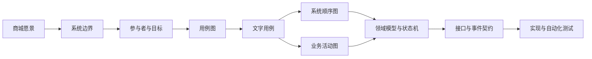

图中每个产物都回答一个不同的问题：

- 系统边界说明商城负责什么。
- 用例说明参与者怎样借助商城达成目标。
- 系统顺序图说明跨边界的信息怎样交换。
- 活动图说明不同参与者怎样完成一笔完整交易。
- 类图和状态图把需求中的业务概念及规则固定下来。
- 验收场景用于判断实现是否满足需求。

需求发生变化时，应沿着这条链检查后续图、契约、代码和测试，而不是只改一处文字。

## 2. 商城愿景与最小业务范围

tiny-oomall 为顾客、商户和平台管理员提供一个最小的线上商品交易平台。商户提交店铺和商品资料，平台管理员审核后允许销售；顾客浏览商品、加入购物车、创建订单并通过支付平台付款；商户处理已付款订单并标记发货；顾客确认收货后交易完成。

### 2.1 范围内功能

| 业务领域 | 系统必须提供的最小能力 |
| --- | --- |
| 顾客账号 | 注册、登录、退出、保存收货地址 |
| 商户准入 | 商户提交店铺申请，平台管理员批准或拒绝 |
| 商品管理 | 商户提交商品，平台管理员审核，商户上架或下架 |
| 商品浏览 | 顾客查看在售商品列表和商品详情 |
| 购物车 | 顾客加入、修改、删除和查看自己的购物车项 |
| 订单 | 顾客创建、查看和取消未付款订单 |
| 支付 | 创建支付交易、接收支付结果、处理重复回调 |
| 履约 | 商户查看已付款订单并标记发货，顾客确认收货 |
| 平台治理 | 平台管理员审核店铺和商品，暂停违规店铺或商品 |

### 2.2 明确不进入本项目的功能

- 优惠券、满减、团购、预售和会员价；
- 多级分销、结算、分账和商户提现；
- 退款、退货、换货、维修和争议仲裁；
- 发票、仓储、采购和供应商管理；
- 配送渠道、运单、轨迹和运费模板；
- 行政区划树及其独立数据服务；
- 推荐、评价、直播和社交功能。

收货地址只保存 `consignee`、`mobile` 和 `address` 三项业务信息。订单创建时复制地址快照，之后顾客修改地址不会改变历史订单。

### 2.3 系统成功的判断

最小闭环不是“所有页面都能打开”，而是下面这条业务链可以完整执行并能处理关键失败：


成功标准：未经审核的店铺不能销售，未经审核或未上架的商品不能下单，库存不能卖成负数，支付金额必须等于订单应付金额，重复支付回调不能重复改变订单，只有已付款订单才能发货，只有已发货订单才能确认收货。

## 3. 系统边界与参与者

### 3.1 System Context

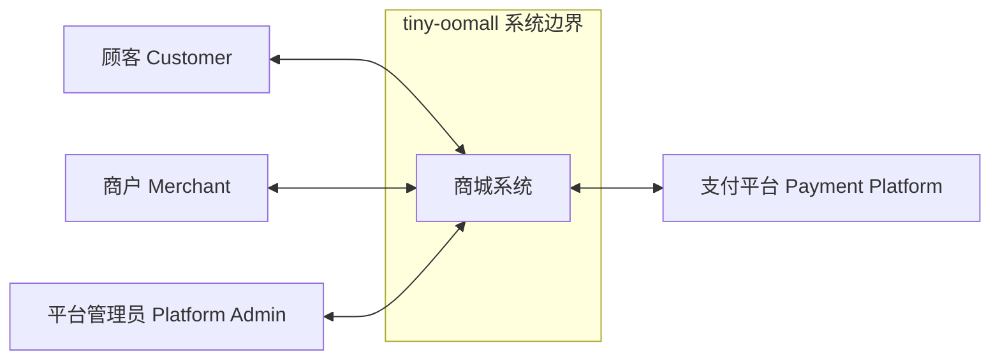

图的阅读方式：顾客、商户和平台管理员直接操作商城，是主参与者；支付平台不使用商城完成自己的业务目标，而是为商城提供支付能力，是辅助参与者。数据库、Redis、RocketMQ、定时任务和商城内部模块都不属于需求模型中的参与者。

### 3.2 主参与者

| 参与者 | 职责 | 主要目标 | 不能做的事情 |
| --- | --- | --- | --- |
| 顾客 | 选购并接收商品 | 注册登录、维护地址、浏览商品、管理购物车、下单、付款、查单、取消未付款订单、确认收货 | 操作其他顾客资源；修改价格、库存和订单状态 |
| 商户 | 提供并履行商品 | 申请店铺、提交商品、上下架、查看店铺订单、标记发货 | 审核自己的店铺或商品；读取其他商户订单；发货未付款订单 |
| 平台管理员 | 维护平台经营秩序 | 审核店铺、审核商品、暂停或恢复店铺、禁售商品 | 代替顾客支付；直接篡改支付平台结果 |

### 3.3 辅助参与者

| 参与者 | 向商城提供的能力 | 商城必须保存的结果 |
| --- | --- | --- |
| 支付平台 | 创建支付交易、返回调起信息、通知支付结果、查询交易状态 | 商城支付单号、渠道交易号、金额、支付状态和完成时间 |

### 3.4 参与者识别规则

判断一个角色是否为主参与者时，依次检查：

1. 该角色是否直接操作商城；
2. 操作是否为了达成自己的业务目标；
3. 目标是否产生可识别的业务价值和持久结果；
4. 该目标是否属于已确认的系统边界。

例如“系统自动关闭超时订单”没有外部角色直接发起，是订单规则，不是独立主参与者用例。“用户登录”通常只是购买等目标的前置条件；在本项目中将登录作为账号模块的独立教学用例，但不把它画进购买主流程。

## 4. 参与者目标与用例边界

### 4.1 参与者—目标表

| 参与者 | 目标 | 触发事件 | 成功后的业务结果 |
| --- | --- | --- | --- |
| 顾客 | 注册账号 | 决定使用商城 | 形成可登录顾客账号 |
| 顾客 | 保存收货地址 | 需要为订单准备收货信息 | 形成归属顾客的地址 |
| 顾客 | 浏览商品 | 有购买意向 | 得到当前可购买的商品信息 |
| 顾客 | 管理购物车 | 暂存购买意向 | 形成归属顾客的购物车项 |
| 顾客 | 创建订单 | 决定购买所选商品 | 形成待付款订单并扣减可售库存 |
| 顾客 | 支付订单 | 决定付款 | 形成成功支付记录和已付款订单 |
| 顾客 | 取消订单 | 不再购买未付款订单 | 订单关闭且库存归还 |
| 顾客 | 查看订单 | 了解交易状态 | 得到自己的订单详情 |
| 顾客 | 确认收货 | 已收到商品 | 订单变为已完成 |
| 商户 | 申请店铺 | 决定在平台经营 | 形成待审核店铺申请 |
| 商户 | 提交商品 | 决定销售新品 | 形成待审核商品 |
| 商户 | 上架商品 | 商品通过审核并准备销售 | 形成具有价格、库存和销售期的销售项 |
| 商户 | 下架商品 | 决定停止新交易 | 销售项不再接受新订单 |
| 商户 | 查看店铺订单 | 准备履约 | 得到本店订单列表和详情 |
| 商户 | 标记发货 | 已把商品交付出去 | 已付款订单变为已发货 |
| 平台管理员 | 审核店铺 | 收到店铺申请 | 店铺获准经营或被拒绝 |
| 平台管理员 | 审核商品 | 收到商品申请 | 商品获准上架或被拒绝 |
| 平台管理员 | 治理店铺和商品 | 发现违规经营内容 | 店铺暂停或商品禁售 |

### 4.2 用例的判定标准

用户目标用例应尽量通过 EBP 测试：一名主参与者在一段连续时间内，响应一个业务事件，完成一组连续操作，获得业务价值并留下持久结果。

“商户提交并由平台审核商品”不能合成一个用户目标用例，因为它由两名参与者在不同时间完成。应拆成“提交商品”和“审核商品”。“支付成功后更新订单”也不单独建成顾客用例，它是支付用例成功后的系统保证。

## 5. 用例模型

### 5.1 总用例图

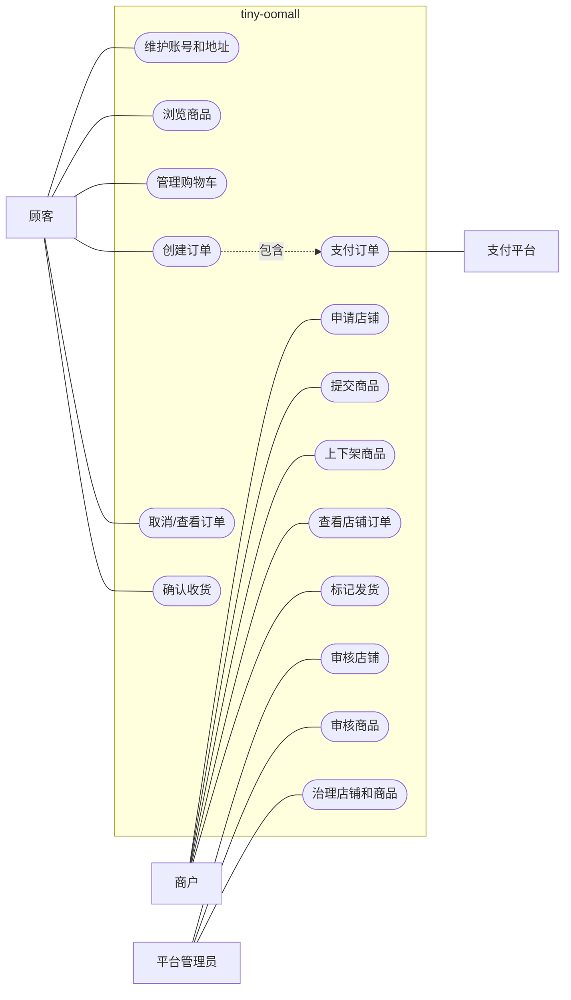

这张图是需求目录，不描述按钮、接口和类。创建订单与支付在业务上连续，但订单在支付前已经形成，因此“支付订单”作为可单独重试的子功能用例描述。

### 5.2 文字用例模板

每个用例使用同一格式：

```markdown
### 用例名称

- 级别：用户目标 / 子功能
- 主参与者：
- 触发事件：
- 前置条件：
- 成功保证：

#### 主成功场景

| 步骤 | 参与者与系统的行为 | 交换的信息 |
| --- | --- | --- |

#### 扩展场景

| 分支 | 条件与处理 | 交换的信息 |
| --- | --- | --- |

#### 特殊要求

- 与本用例直接相关的权限、可靠性、性能和审计要求。
```

用例只写参与者与系统之间可观察的行为及信息，不写 Controller、Service、SQL、Redis Key 或页面布局。

## 6. 核心文字用例

### 6.1 申请与审核店铺

#### 申请店铺

- 级别：用户目标
- 主参与者：商户
- 触发事件：商户决定在商城经营。
- 前置条件：商户身份已建立，当前没有有效店铺。
- 成功保证：形成归属该商户的待审核店铺申请。

| 步骤 | 主成功场景 | 交换的信息 |
| --- | --- | --- |
| 1 | 商户请求申请店铺。 | 商户身份 |
| 2 | 系统显示需要提交的店铺资料。 | 店铺名称、联系人、联系电话 |
| 3 | 商户提交店铺资料。 | 店铺名称、联系人、联系电话 |
| 4 | 系统保存申请并显示待审核状态。 | 店铺标识、申请状态 |

| 分支 | 扩展场景 | 交换的信息 |
| --- | --- | --- |
| 3a | 店铺名称已被使用；系统拒绝提交并说明原因。 | 冲突名称 |
| 3b | 商户已有待审核或有效店铺；系统拒绝重复申请。 | 原店铺及状态 |

#### 审核店铺

- 级别：用户目标
- 主参与者：平台管理员
- 触发事件：平台出现待审核店铺申请。
- 前置条件：管理员已登录，申请仍处于待审核状态。
- 成功保证：申请变为已批准或已拒绝；只有已批准店铺可以提交销售商品。

| 步骤 | 主成功场景 | 交换的信息 |
| --- | --- | --- |
| 1 | 管理员查看待审核店铺。 | 店铺标识、名称、申请时间 |
| 2 | 系统显示所选店铺资料。 | 店铺资料、商户信息 |
| 3 | 管理员批准申请。 | 审核决定 |
| 4 | 系统将店铺标记为可经营并记录审核结果。 | 店铺状态、审核人、审核时间 |

| 分支 | 扩展场景 | 交换的信息 |
| --- | --- | --- |
| 3a | 管理员拒绝申请并填写原因。 | 拒绝原因 |
| 3b | 申请已被其他管理员处理；系统拒绝重复审核并显示当前结果。 | 当前审核状态 |

### 6.2 提交、审核与上架商品

#### 提交商品

- 主参与者：商户
- 前置条件：店铺状态为可经营。
- 成功保证：形成归属本店铺的待审核商品。

| 步骤 | 主成功场景 | 交换的信息 |
| --- | --- | --- |
| 1 | 商户请求新增商品。 | 店铺身份 |
| 2 | 系统显示商品资料要求。 | 商品名称、类目、参考价、单位、简介 |
| 3 | 商户提交资料。 | 商品名称、类目、参考价、单位、简介 |
| 4 | 系统保存商品并显示待审核状态。 | 商品标识、审核状态 |

扩展：店铺被暂停时拒绝提交；必填业务资料不完整时指出缺失项；重复提交不得产生两个相同申请。

#### 审核商品

- 主参与者：平台管理员
- 前置条件：商品处于待审核状态。
- 成功保证：商品变为已批准或已拒绝；拒绝时保存原因。

| 步骤 | 主成功场景 | 交换的信息 |
| --- | --- | --- |
| 1 | 管理员查看待审核商品列表。 | 商品名称、店铺、提交时间 |
| 2 | 管理员选择商品。 | 商品标识 |
| 3 | 系统展示商品和店铺资料。 | 商品资料、店铺状态 |
| 4 | 管理员批准商品。 | 审核决定 |
| 5 | 系统保存审核结果。 | 商品状态、审核人、审核时间 |

扩展：管理员拒绝时必须提供原因；商品已被处理时拒绝重复审核；店铺已暂停时不允许批准商品。

#### 上架商品

- 主参与者：商户
- 前置条件：店铺可经营，商品已批准。
- 成功保证：形成可以被顾客购买的销售项。

| 步骤 | 主成功场景 | 交换的信息 |
| --- | --- | --- |
| 1 | 商户选择已批准商品并请求上架。 | 商品标识 |
| 2 | 系统显示销售设置。 | 当前商品资料 |
| 3 | 商户提交销售价格、可售库存和销售时间。 | `price`、`quantity`、`beginTime`、`endTime` |
| 4 | 系统保存销售项并反馈结果。 | 销售项标识、状态 |

扩展：价格或库存小于合法下限时拒绝；开始时间不早于结束时间；店铺或商品状态在提交期间变化时拒绝上架。

### 6.3 管理购物车

- 级别：用户目标
- 主参与者：顾客
- 触发事件：顾客希望保存购买意向。
- 前置条件：顾客已登录。
- 成功保证：购物车只包含归属当前顾客的有效项目。

| 步骤 | 主成功场景 | 交换的信息 |
| --- | --- | --- |
| 1 | 顾客从商品详情加入购物车。 | 销售项标识、数量 |
| 2 | 系统核对销售项当前可购买并保存购物车项。 | 商品名称、当前价格、购买数量 |
| 3 | 系统显示更新后的购物车。 | 购物车项、展示小计 |

| 分支 | 扩展场景 | 交换的信息 |
| --- | --- | --- |
| 2a | 销售项已下架、未开始、已结束或售罄；系统拒绝加入。 | 不可购买原因 |
| 2b | 同一销售项已存在；系统合并数量，不创建重复项。 | 合并后的数量 |
| 2c | 数量不合法或超过单次购买上限；系统拒绝修改。 | 合法范围 |

购物车中的价格只用于提示变化。创建订单时必须重新取得当前价格、状态和库存。

### 6.4 创建订单

- 级别：用户目标
- 主参与者：顾客
- 触发事件：顾客决定购买选中的购物车项。
- 前置条件：顾客已登录；购物车项和地址归当前顾客。
- 成功保证：形成一个待付款订单；订单项保存成交快照；可售库存已经扣减。

| 步骤 | 主成功场景 | 交换的信息 |
| --- | --- | --- |
| 1 | 顾客选择购物车项和收货地址并提交。 | 购物车项标识、地址标识、请求标识 |
| 2 | 系统重新取得销售项并显示订单确认信息。 | 商品名称、成交价、数量、收件人、手机号、地址、商品总额 |
| 3 | 顾客确认创建订单。 | 确认结果 |
| 4 | 系统扣减库存并保存订单和订单项。 | 订单号、订单状态、应付金额、付款截止时间 |
| 5 | 系统向顾客显示待付款订单。 | 订单详情 |

| 分支 | 扩展场景 | 交换的信息 |
| --- | --- | --- |
| 1a | 地址或购物车项不属于当前顾客；系统拒绝请求。 | 无权访问的资源 |
| 2a | 销售项不再可售；系统指出受影响商品，不创建订单。 | 商品及原因 |
| 2b | 当前价格与购物车展示价格不同；系统显示新价格并要求重新确认。 | 原展示价、当前价 |
| 4a | 库存不足；系统不保存订单，不允许库存为负数。 | 请求数量、当前可售量 |
| 4b | 相同请求标识已经成功创建订单；系统返回原订单。 | 原订单号和金额 |
| 4c | 多个库存项中途扣减失败；系统不得留下部分订单或部分永久扣减。 | 失败商品 |

特殊要求：一张订单只属于一个顾客、一个商户；客户端提交的顾客 ID、商品价格、订单金额和状态都不可信；应付金额等于订单项成交价乘数量之和。

### 6.5 支付订单

- 级别：子功能
- 主参与者：顾客
- 辅助参与者：支付平台
- 触发事件：顾客选择待付款订单支付。
- 前置条件：订单属于当前顾客，状态为待付款且未过付款截止时间。
- 成功保证：商城保存唯一成功支付事实，订单变为已付款。

| 步骤 | 主成功场景 | 交换的信息 |
| --- | --- | --- |
| 1 | 顾客请求支付订单。 | 订单标识 |
| 2 | 系统显示应付金额和支付渠道。 | 订单号、应付金额、渠道 |
| 3 | 顾客确认支付。 | 所选渠道 |
| 4 | 系统向支付平台创建交易并向顾客返回支付凭据。 | 商城支付单号、金额、支付凭据 |
| 5 | 支付平台通知商城支付成功。 | 渠道交易号、商城支付单号、金额、结果时间 |
| 6 | 系统确认支付单并把订单标记为已付款。 | 支付状态、订单状态 |
| 7 | 系统向顾客显示支付结果。 | 订单号、付款金额、完成时间 |

| 分支 | 扩展场景 | 交换的信息 |
| --- | --- | --- |
| 1a | 订单不存在、不属于当前顾客或状态不允许付款；系统拒绝。 | 失败原因 |
| 4a | 支付平台创建交易超时；系统保留待确认支付单，允许查询或重试。 | 商城支付单号 |
| 5a | 回调金额与订单应付金额不同；系统记录异常，不确认订单。 | 期望金额、回调金额 |
| 5b | 相同回调重复到达；系统返回已处理结果，不重复改变订单。 | 渠道交易号、处理结果 |
| 5c | 通知未到达；系统使用支付单号向支付平台查询权威状态。 | 商城支付单号、查询结果 |
| 6a | 订单已取消；系统记录支付与订单冲突，不静默覆盖订单状态。 | 订单状态、支付状态 |

### 6.6 发货与确认收货

#### 标记发货

- 主参与者：商户
- 前置条件：订单属于本店铺并处于已付款状态。
- 成功保证：订单变为已发货，保存操作人和发货时间。

| 步骤 | 主成功场景 | 交换的信息 |
| --- | --- | --- |
| 1 | 商户查看本店已付款订单。 | 订单号、商品、数量、收货信息 |
| 2 | 商户选择订单并确认已发货。 | 订单标识 |
| 3 | 系统校验归属和状态后保存发货结果。 | 已发货状态、发货时间 |

扩展：其他商户订单不可操作；待付款、已发货、已完成或已取消订单不能再次发货。

#### 确认收货

- 主参与者：顾客
- 前置条件：订单属于当前顾客并处于已发货状态。
- 成功保证：订单变为已完成，保存完成时间。

| 步骤 | 主成功场景 | 交换的信息 |
| --- | --- | --- |
| 1 | 顾客查看已发货订单。 | 订单详情、发货时间 |
| 2 | 顾客确认已经收到商品。 | 订单标识 |
| 3 | 系统保存完成状态并反馈结果。 | 完成时间、订单状态 |

扩展：不属于当前顾客的订单不可操作；非已发货订单不能确认；重复确认返回已完成结果，不重复执行副作用。

## 7. 端到端业务活动图

### 7.1 店铺准入与商品发布

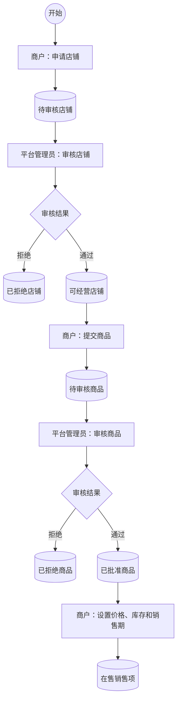

流程说明：店铺和商品分两次审核，因为申请与审核由不同参与者在不同时间完成。商品审核通过并不等于立即可购买；商户还要提供价格、库存和销售时间形成销售项。

### 7.2 购买、支付与履约

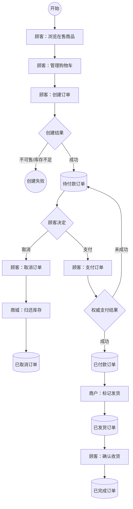

流程说明：订单创建成功即扣减库存。顾客取消未付款订单时归还库存；支付未成功时订单仍保持待付款，直到顾客重试、主动取消或付款期限到达。支付成功后只有订单所属商户可以发货，最后由订单所属顾客确认收货。

### 7.3 活动与用例的区别

活动图中的“商城：归还库存”是系统内部动作，没有新的主参与者目标，因此不独立建用户目标用例。它必须出现在取消订单的成功保证和自动化测试中。

## 8. 系统顺序图

### 8.1 创建订单

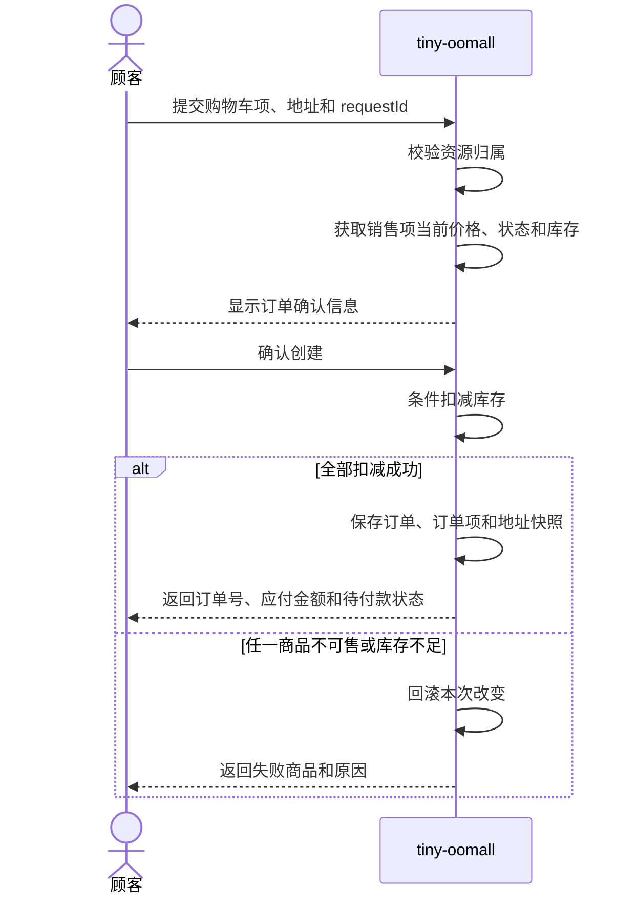

需求级图把商城作为一个整体，不出现 Controller、Repository、MySQL 或微服务名称。内部模块之间怎样协作在架构设计中再展开。

### 8.2 支付订单

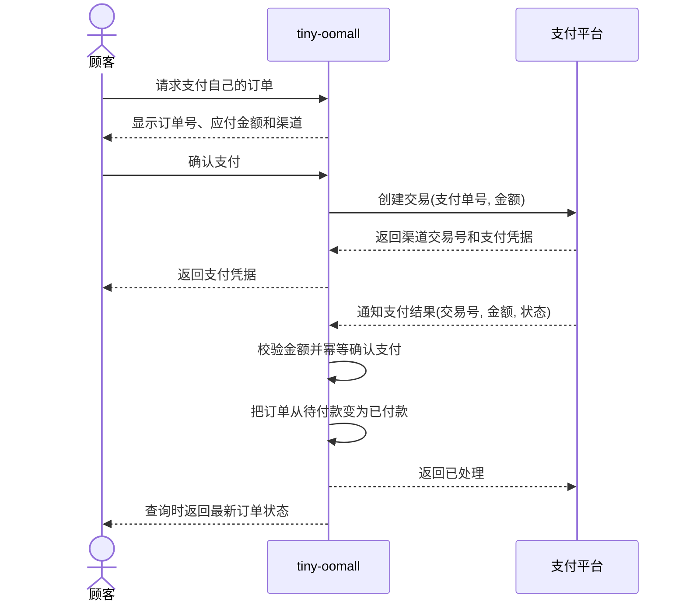

当通知超时或状态不确定时，商城以自己的支付单号向支付平台主动查询。顾客端页面显示“支付成功”不能代替支付平台的权威结果。

### 8.3 标记发货与确认收货

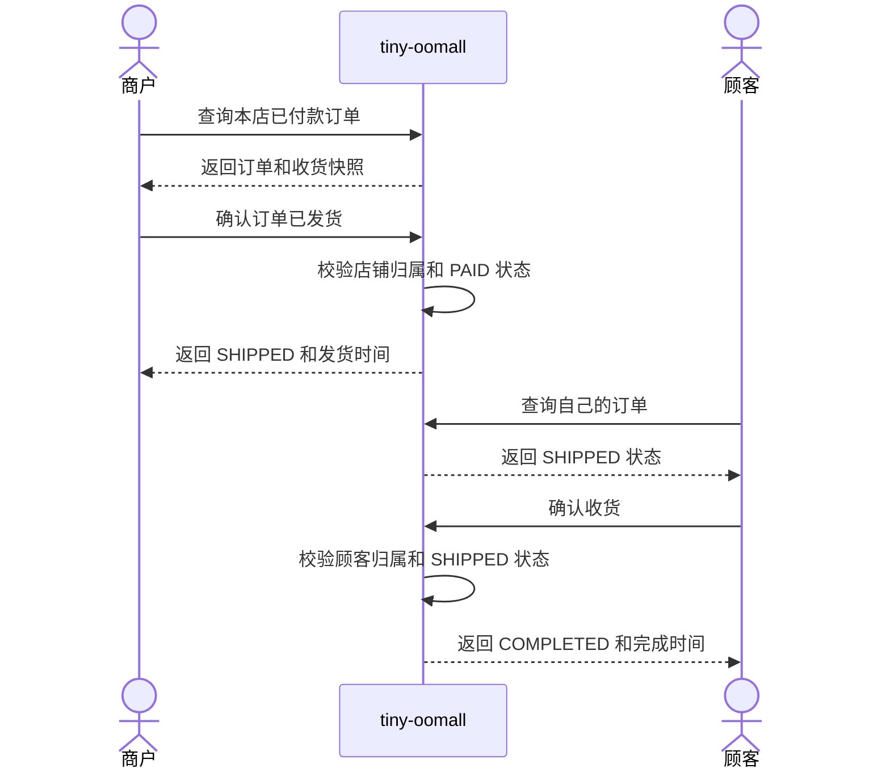

## 9. 领域概念 UML

### 9.1 核心领域类图

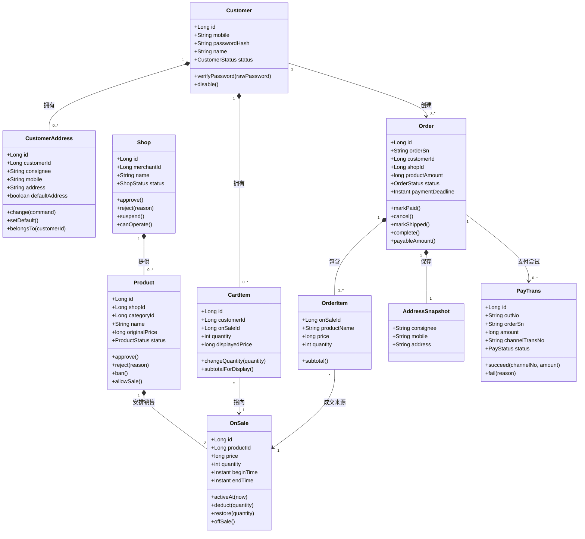

类图说明：`Product` 保存经审核的商品资料，`OnSale` 保存一次可购买安排，价格和库存属于 `OnSale`；购物车引用销售项，但订单项必须保存成交时的名称、价格和数量快照；支付交易独立于订单，一张订单可以有多次支付尝试，但只能有一个有效成功结果。

### 9.2 模块职责图

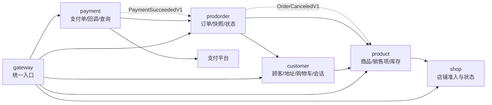

模块说明：每个模块拥有自己的数据，禁止跨库查询。`prodorder` 在创建订单时取得地址与销售项快照；`payment` 从订单契约取得应付金额；支付成功事件通知订单改变状态；订单取消事件通知商品模块归还库存。

## 10. 状态机

### 10.1 店铺状态

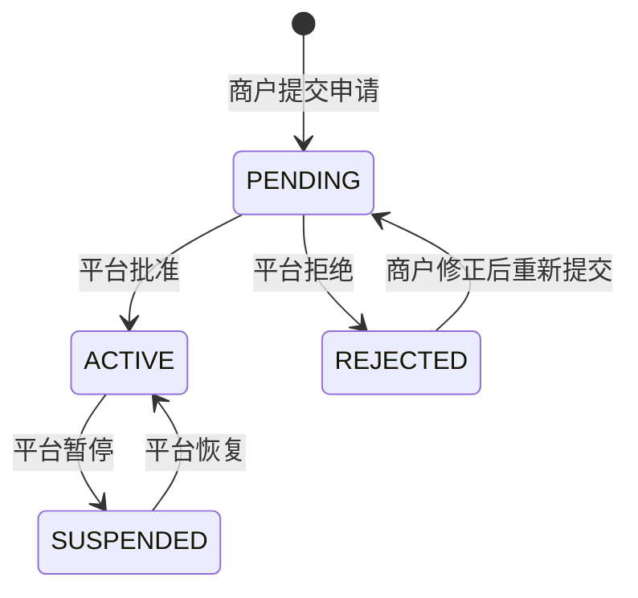

只有 `ACTIVE` 店铺可以提交商品、上架商品和处理新订单。暂停店铺不删除历史订单。

### 10.2 商品与销售项状态

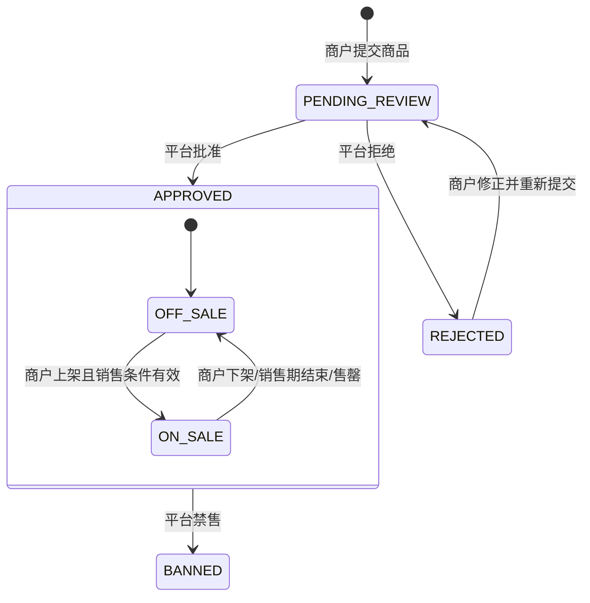

审核状态与销售状态不是同一个概念。商品获得批准后，商户才能创建销售项；平台禁售商品时，现有销售项不能继续接受新订单。

### 10.3 订单状态

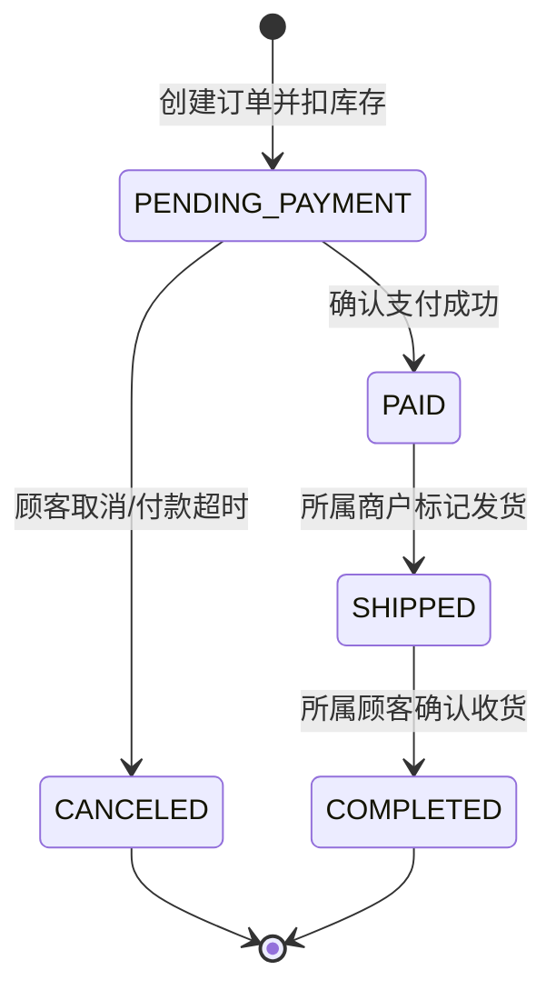

不允许的迁移必须返回稳定业务错误。例如 `PENDING_PAYMENT → SHIPPED`、`PAID → CANCELED`、`COMPLETED → SHIPPED` 都不合法。

### 10.4 支付状态

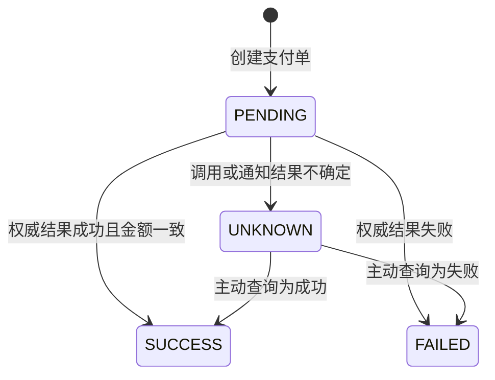

`UNKNOWN` 表示技术上暂时不知道结果，不等于支付失败。只有支付平台的权威通知或查询结果可以把支付单变为 `SUCCESS`。

## 11. 关键跨模块契约

### 11.1 同步查询契约

| 调用方 | 提供方 | 契约 | 必须返回的信息 |
| --- | --- | --- | --- |
| `customer` | `product` | 查询购物车展示快照 | 销售项、商品名、当前价格、是否可购买 |
| `prodorder` | `customer` | 取得当前顾客拥有的地址快照 | 收件人、手机号、地址 |
| `prodorder` | `product` | 取得销售项成交快照 | 店铺、商品名、成交价、可售状态和库存 |
| `payment` | `prodorder` | 取得可支付订单 | 订单号、顾客、应付金额、状态和截止时间 |

### 11.2 事件契约

| 事件 | 生产者 | 消费者 | 业务作用 | 幂等键 |
| --- | --- | --- | --- | --- |
| `PaymentSucceededV1` | `payment` | `prodorder` | 把待付款订单变为已付款 | `eventId`，并检查支付单号 |
| `OrderCanceledV1` | `prodorder` | `product` | 归还订单占用的库存 | `eventId`，并检查订单号 |
| `ProductChangedV1` | `product` | 查询投影（若实现） | 刷新只读商品列表 | `eventId` 与聚合版本 |

消息只传递业务事实，不直接序列化数据库实体。消费者重复收到同一个事件时必须返回相同业务结果。

## 12. FURPS+ 质量要求

| 维度 | 本项目要求 | 验收方法 |
| --- | --- | --- |
| 功能 | 完成店铺审核、商品审核、购买、支付、发货和收货闭环 | 端到端测试 |
| 易用性 | 失败结果指出受影响资源和下一步，不只返回“操作失败” | API/页面验收 |
| 可靠性 | 重复下单请求、重复支付回调和重复事件不产生重复副作用 | 幂等集成测试 |
| 性能 | 商品列表与详情的目标响应时间在测试环境基线中给出 | 受控负载测试 |
| 可支持性 | 订单号、支付单号、事件 ID 和 Request ID 可关联查询 | 日志与故障演练 |
| 接口 | 支付平台超时、重复、延迟和结果冲突都有明确处理 | Adapter 契约测试 |
| 安全 | 身份来自可信会话；客户端资源所有者 ID、金额和状态不可信 | 越权与篡改测试 |

具体性能数字应在团队确定硬件、数据规模和并发模型后写入测试基线。不能用“高并发”“响应迅速”代替可度量条件。

## 13. 需求到验收的追踪矩阵

| 业务目标 | 用例 | 状态/图 | 主要模块 | 最低自动化验收 |
| --- | --- | --- | --- | --- |
| 商户获得经营资格 | 申请店铺、审核店铺 | 店铺状态图、准入活动图 | `shop` | 重复申请、重复审核、拒绝原因、暂停店铺 |
| 商户发布商品 | 提交商品、审核商品、上架商品 | 商品状态图、发布活动图 | `product`、`shop` | 未审核不可上架、暂停店铺不可销售、非法价格库存 |
| 顾客保存购买意向 | 管理购物车 | 购物车文字用例 | `customer`、`product` | 合并同项、下架商品、越权访问、价格变化 |
| 顾客形成订单 | 创建订单 | 创建订单顺序图、订单状态图 | `prodorder`、`customer`、`product` | 快照、库存不足、价格变化、重复提交、事务回滚 |
| 顾客付款 | 支付订单 | 支付顺序图、支付状态图 | `payment`、`prodorder` | 金额篡改、重复回调、超时查询、订单状态冲突 |
| 商户完成履约 | 标记发货 | 履约顺序图、订单状态图 | `prodorder` | 商户归属、未付款发货、重复发货 |
| 顾客完成交易 | 确认收货 | 履约顺序图、订单状态图 | `prodorder` | 顾客归属、错误状态、重复确认 |

## 14. 分阶段实现顺序

### 阶段一：账号与权限

实现顾客注册、登录、地址和统一身份上下文。验收重复手机号、密码哈希、Session 过期、资源越权及地址快照字段完整性。

### 阶段二：店铺准入

实现商户申请和平台管理员审核。验收状态迁移、重复审核、拒绝原因、商户归属和暂停后的写操作限制。

### 阶段三：商品与库存

实现商品提交、审核、销售项和条件扣减库存。验收未经审核不能上架、销售时间、价格库存边界、并发购买最后一件商品。

### 阶段四：购物车与订单

实现购物车、订单快照、幂等创建和取消归还库存。验收跨顾客访问、价格变化、单商户订单、部分失败回滚和重复请求。

### 阶段五：支付

实现 FakePay Adapter、支付单、回调幂等、主动查询和支付成功事件。验收金额篡改、重复/乱序通知、未知状态恢复和订单只确认一次。

### 阶段六：发货与确认收货

实现商户标记发货和顾客确认收货，不接入外部配送能力。验收订单归属、合法状态迁移、操作时间和重复请求。

### 阶段七：工程闭环

补齐 Gateway、Nacos、Redis、RocketMQ、数据库迁移、契约测试、端到端测试、Kubernetes 部署、日志指标与回滚演练。技术设施不改变前面已经确认的业务边界。

## 15. 需求评审清单

### 范围

- [ ] 所有功能都服务于四方最小交易闭环。
- [ ] 收货地址没有依赖独立区划数据。
- [ ] 发货只改变订单状态，不建立运单和轨迹模型。
- [ ] 没有优惠、售后、分账等扩展业务混入实现。

### 用例

- [ ] 每个用户目标用例只有一名主参与者。
- [ ] 主成功场景从触发事件走到明确业务结果。
- [ ] 重要失败都挂到对应步骤，并给出系统结果。
- [ ] 用例没有出现 Controller、表名或中间件等设计细节。

### UML

- [ ] 用例图中的每个椭圆都有文字说明或明确目录归属。
- [ ] 系统顺序图只展示跨边界交互。
- [ ] 活动图能从开始走到成功与失败终点。
- [ ] 类图中的属性和行为能从用例信息与业务规则找到来源。
- [ ] 状态图中的每条迁移都有参与者操作、支付结果或内部规则触发。

### 验收

- [ ] 每个主成功场景至少有一个自动化测试。
- [ ] 每个资金、库存、权限和状态分支至少有一个反例测试。
- [ ] 能从失败测试反查用例分支和业务规则。
- [ ] 重复请求、超时与并发不是口头说明，而是可执行测试。

完成本节检查后，需求模型可以进入接口设计和代码实现；任何新增功能都应先修改系统边界、用例和验收矩阵，再进入迭代。
